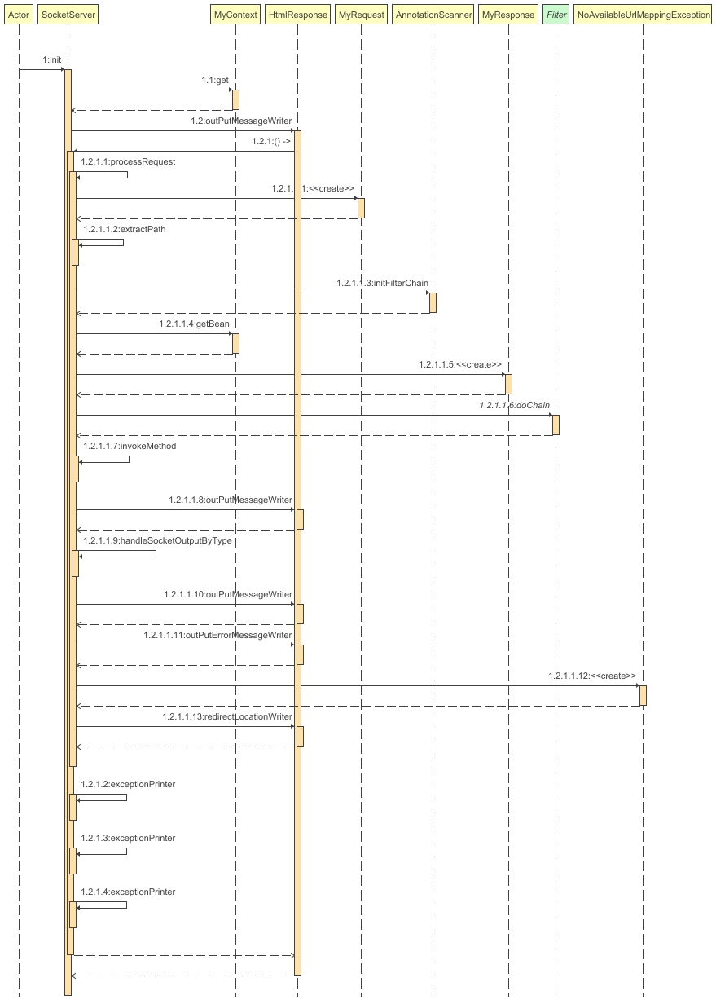

# AutumnFramework
对spring的拙劣的模仿


## 注意事项:
- 现在框架可以选择依赖的环境,有我写的SocketServer和TomCat两种,默认是SocketServer,如果你想用内嵌的TomCat请自行找到切换的开关
- `仅仅是一个玩具级别的Demo,无论是Web服务层还是Bean容器也好,都是非常简陋的实现,仅仅模仿SpringBoot的表层实现与基本特性,不具备任何实际使用价值仅供学习参考.感谢异步图书的SpringBoot源码解读与原理分析这本书,读一些源码变得简单很多 `
- 编译结束后方法形参名称可能不保留,为了泛用性选择了形参注解标注形参
- 目前仅支持调用字段的无参默认构造器注入
- 框架中的ioc容器只负责基本的依赖注入,现在用户可以编写自己的后置处理器干预BeanDefinition的生产过程,我们`约定`在Resources文件夹下创建一个Plugins文件夹,放置一些xml用来声明后置处理器,容器在启动的时候会调用postProcessBeanDefinitionRegistry或postProcessBeanFactory
- postProcessBeanDefinitionRegistry可以在正常的BeanDefinition注册后对其进行增删改查,创建新的BeanDefinition,或者修改已有的BeanDefinition.postProcessBeanFactory则仅可修改删除BeanDefinition,因此如果想实现Mybatis那样代理接口注入实现类的处理器,则需要声明为postProcessBeanDefinitionRegistry,同时可以使用PriorityOrdered与Ordered接口声明优先级
```xml
<?xml version="1.0" encoding="UTF-8"?>
<beans>
    <AutumnStarters>
        <bean class="org.example.FrameworkUtils.Orm.MineBatis.MineBatisStarter"/>
        <bean class="org.example.FrameworkUtils.AutumnCore.Aop.JokePostProcessor"/>
    </AutumnStarters>
</beans>
 ```
- MineBatis目前只可以进行查询,不能增删改,马上就会加上这些功能.另外现在只可以注册XmlMapper,注解注册的方式日后添加
- MineBatis的TypeHandler扫描也将在最近加入
- 如果使用idea可以在xml加入如下内容以获得idea代码提示与跳转,用其他的ide就可以不加

```html
<!DOCTYPE mapper PUBLIC "-//mybatis.org//DTD Mapper 3.0//EN" "http://mybatis.org/dtd/mybatis-3-mapper.dtd">
 ```

- 项目使用JDK17运行,16之后注解处理器的写法开始改变,而且有非常多的坑,这也是研究了两三天才完成了这个简易的注解处理器在编译期修改AST的功能,如果你想要在编译期修改AST,请参考我的代码,我已经把所有的坑都踩过了
- IDEA给javac又套了一层,会出现class org.AutumnAP.FrameworkAnnotationProcessor (in unnamed module @0x6eb1a122) cannot
  access class com.sun.tools.javac.api.BasicJavacTask (in module jdk.compiler) because module jdk.compiler does not
  export com.sun.tools.javac.api to unnamed module @0x6eb1a122的问题,加入javac编译参数-Djps.track.ap.dependencies=false貌似可以解决
- 想使用注解处理器先执行`mvn install:install-file -Dfile=src/main/resources/libs/AutumnAnP.jar -DgroupId=org.AutumnAP -DartifactId=AutumnAnP -Dversion=1.0-SNAPSHOT -Dpackaging=jar `再执行`mvn clean install`
## 打个广告:

- ~~大四没事干,~~找了个java实习一个月2000~~,大连的hr有没有想联系我的 邮箱:~~ 已经找到工作了

## 整点好玩的:

- 现在框架加入了一个`编译期`注解@EnableAutumnFramework,你只需要在主类上加入它然后一行代码也不用写,留一个空的main方法程序就会开始执行

## 项目描述:
不依赖TomCat,Servlet等技术实现的网络服务框架,参照了Mybatis,SpringMvc等设计思想从0手写了一个基于注解的仿SpringBoot框架

## 已经实现:
- socket实现的网络服务,简单的支持网页输出,GET,POST方法传参,controller声明形参直接注入
- url-method映射,实现url与controller方法的路由表
- 由三级缓存组成的ioc容器,解决循环依赖的问题
- 非常弱的依赖注入实现,可以实现@autowired标注的字段的自动注入,以及@value注入配置文件,还可以注入接口的实现类,基本上和springboot写法一样了
- cglib实现的aop,稍微解决了代理类注解擦除的问题,可以正常依赖注入
- Mybatis的简易实现,使用jdk动态代理接口,实现参数映射以及实体类映射
- 加入了责任链模式的过滤器,~~使用@order声明顺序~~
- 实现@Bean功能,添加配置类,配置框架行为
- 用户重写autumnMvcConfig接口覆盖默认实现类,实现自定义首页面,icon等
- 简易的RedisTemplate加入,可以连接redis了
- 加入了Json与JavaBean的转换,可以跟前端用Json通讯了
- 类级别的条件注解的完整加入,用户可以自定义处理器了,只需要实现condition接口覆盖match逻辑
- Response类加入,用户可以选择自己来控制返回头和内容,例如进行setCookie操作
- Cookie,session加入,自动为新用户setCookie,设置JSESSIONID
- 依照JSESSIONID的value查找对应的session
- 简易的Swagger加入
- 循环依赖提示器加入
- 简易的WebSocket加入,仿照Springboot写法可以处理协议升级与后续数据传递,此过程通过注解指定处理器
- @Bean功能可以使用自定义名字了,使用@AutumnBean("beanName")与@MyAutowire("beanName")实现为同一个字段注入不同实例
- @Bean功能可以自定义Init方法了,在依赖注入之后立刻调用
- 用户可以自定义后置处理器,干预BeanDefinition的生产过程,例如Mapper的注入,框架在启动的时候会调用,现在只提供Xml读取的方式
- Aop模块重写,实现了Aop处理器的复用,从现在开始@EnableAop注解降级为用户态注解,仅作为一个简单的标记,框架通过CgLibAop, InstantiationAwareBeanPostProcessor两个接口在Bean实例化之前替换实现类的方式完成代理类的替换,有关Aop的一切均开放给用户,拦不拦截,怎么拦截都是你说的算,只要你实现AutumnAopFactory接口并加入@MyAspect注解我们就会帮你代理
- 运行时环境判定,可以选择用SocketServer启动或者拉起内嵌的TomCat,如果你喜欢Netty可以自行写适配器,转化为标准的AutumnRequest/Response接口实现

## 好玩的示范 通过修改AST抽象语法树实现一个编译期的注解处理器,这下真的就是全自动了,你只需要在主类上加入@EnableAutumnFramework,然后一行代码也不用写,留一个空的main方法程序就会开始执行,就像Lombok一样简单

```java

@MyConfig
@Slf4j
@EnableAutumnFramework
public class Main {
  public static void main(String[] args) throws ClassNotFoundException {
  }

}
```

- 如果你遇到了问题请回退到

```java

@MyConfig
@Slf4j
public class Main {
  public static void main(String[] args) throws ClassNotFoundException {
    AutumnFrameworkRunner autumnFrameworkRunner = new AutumnFrameworkRunner();
    autumnFrameworkRunner.run(Main.class);
  }
}
```
## 代码示范 MVC章节
### Controller
```java
@MyController
@Slf4j
public class AutumnTestController {
  //xxx:测试配置文件注入器
  @Value("url")
  private String sqlUrl;

  //xxx:测试自身循环依赖
  @MyAutoWired
  private AutumnTestController autumnTestController;

  @MyAutoWired
  LoginService loginService;

  @MyAutoWired
  UserMapper userMapper;

  @MyAutoWired
  MyReidsTemplate myReidsTemplate;

  @MyAutoWired("postProcessChange")
  Car car;

  @MyAutoWired
  SqlSession sqlSession;

  @MyAutoWired
  Test test;

  //xxx:测试request功能
  @MyRequestMapping("/request")
  public String requestTest(AutumnRequest request) {
    return request.getUrl() + request.getMethod() + request.getParameters();
  }


  //xxx:测试response与setCookie功能
  @MyRequestMapping("/response")
  public void responseTest(AutumnResponse myResponse) {
    Cookie cookie = new Cookie("newcookie", "session1");
    myResponse.setCode(200)
            .setCookie(cookie)
            .setView(new View("AutumnFrameworkMainPage.html"))
            .outputHtml();
  }

  //xxx:测试参数注入
  @MyRequestMapping("/paramTest")
  public String paramTest(@MyRequestParam("name") String name, @MyRequestParam("age") String age) {
    return name + age;
  }

  //xxx:循环依赖测试
  @MyRequestMapping("/cycletest")
  public Map<String, Object> cycleTest() {
    return autumnTestController.mapTest();
  }

  //xxx:测试@Bean("BeanName")功能是否正常,同时看看Json解析器好不好用
  @MyRequestMapping("/map")
  public Map<String, Object> mapTest() {
    Map<String, Object> myMap = new HashMap<>();
    myMap.put("url", sqlUrl);
    log.info(car.toString());
    log.info(test.toString());
    return myMap;
  }

  //xxx:测试redis
  @MyRequestMapping("/redis")
  public String redis() {
    myReidsTemplate.init();
    myReidsTemplate.set("test", "test");
    return myReidsTemplate.toString() + "\n" + myReidsTemplate.get("test");
  }

  //xxx:测试View层功能
  @MyRequestMapping("/html")
  public View myhtml() {
    return new View("AutumnFrameworkMainPage.html");
  }


  //xxx:测试session功能
  @MyRequestMapping("/session")
  public String session(AutumnRequest myRequest) {
    String sessionId = myRequest.getSession().getSessionId();
    myRequest.getSession().setAttribute("name", sessionId);
    return "切换阅览器查看唯一标识符是否变化? 标识符如下:"+myRequest.getSession().getAttribute("name");
  }

  //xxx:测试WebSocket功能
  @MyRequestMapping("/websocket")
  public MyWebSocket websocketTest() {
    return new MyWebSocket();
  }

  //xxx:测试数据库功能
  @EnableAop
  @MyRequestMapping("/Login")
  public String login(@MyRequestParam("username") @CheckParameter String userId,
                      @MyRequestParam("password") String password) {
    if (loginService.checkLogin(userId, password)) {
      return "登录成功";

    } else {
      return "登录失败";
    }

  }

  //xxx:测试数据库功能
  @MyRequestMapping("/getall")
  public String getAll() {
    return userMapper.getAllUser(0).toString();
  }
  
}
```
### 拦截器
```java
@Slf4j
@MyComponent
@MyOrder(1)
public class UrlFilter implements Filter {
  @MyAutoWired
  IndexFilter indexFilter;

  @Override
  public boolean doChain(AutumnRequest autumnRequest, AutumnResponse autumnResponse) {
    if ("GET".equals(autumnRequest.getMethod())) {
      log.info("一级过滤链拦截,开始第一步鉴权");
//            myResponse.setCode(400).setResponseText("鉴权失败").outputErrorMessage();
      return indexFilter.doChain(autumnRequest, autumnResponse);
    } else {
      log.info("一级过滤链放行");
      return false;
    }
  }
}
```
### Mapper
```java
public interface UserMapper {
    List<User> getOneUser(Integer userId);
    List<User> getAllUser(Integer userId);
    User checkUser(String userId, String password);
}
```
```xml
<mapper namespace="org.example.mapper.UserMapper">
    <select id="getOneUser" resultMap="whyYouDoThis" parameterType="java.lang.Integer">
        SELECT UserID as testUserID,
        Username as testUserName,
        Role,
        `Password`,
        Salt,
        Telephone,
        regTime,
        enabled
        FROM `user`
        where UserId > #{userId}
    </select>

    <select id="getAllUser" resultType="org.example.Bean.User"
            parameterType="java.lang.Integer">
        select * from user  where UserId > #{userId}
    </select>

    <resultMap id="whyYouDoThis" type="org.example.Bean.User" isDisable="false">
        <result property="userID" column="testUserID"/>
        <result property="username" column="testUserName"/>
    </resultMap>

    <select id="checkUser" resultType="org.example.Bean.User">
        select * from user u where Username=#{userId} and Password=#{password}
    </select>
</mapper>
```
```xml
<configuration>
    <dataSource>
        <property name="driverClass" value="com.mysql.cj.jdbc.Driver"/>
        <property name="jdbcUrl"
                  value="jdbc:mysql://localhost:3306/demo?serverTimezone=UTC&amp;useUnicode=true&amp;characterEncoding=utf-8&amp;useSSL=false&amp;allowPublicKeyRetrieval=true"/>
        <property name="username" value="root"/>
        <property name="password" value="root"/>
    </dataSource>

    <mappers>
        <mapper resource="mapper/UserMapper.xml"/>
    </mappers>

    <myConfig>
    </myConfig>
</configuration>
```
如果你不想自动接管Mapper的生成,你也可以使用@Bean的方式注册一个
```java
@AutumnBean
public SqlSession getMapper() throws PropertyVetoException, DocumentException {
    InputStream inputStream = Resources.getResourceAsSteam("minebatis-config.xml");
    SqlSessionFactory sqlSessionFactory = new SqlSessionFactoryBuilder().build(inputStream);
    return sqlSessionFactory.openSession();
}

@MyRequestMapping("/getall")
public String getAll() throws Exception {
    UserMapper userMapperBean=sqlSession.getMapper(UserMapper.class);
    return userMapperBean.getAllUser(0).toString();
}
```
### Service
```java
public interface LoginService {
    boolean checkLogin(String userid, String password);
}

@MyService
public class LoginServiceImpl implements LoginService {
    @MyAutoWired
    UserMapper userMapper;

    @Override
    public boolean checkLogin(String userId, String password) {
        return userMapper.checkUser(userId, password) != null;
    }
}
```
### WebSocket握手 目前仅支持SocketServer运行环境
```java
@MyRequestMapping("/websocketTest")
public MyWebSocket websocketTest(){
    //websocket初始化工作
    return new MyWebSocket();
}
```
### WebSocket处理器
```java
@MyWebSocketConfig("/websocketTest")
@Slf4j
public class WebSocketController implements WebSocketBaseConfig {

    @Override
    public void onOpen() {
        log.warn("切换到WebSocket");
    }

    @Override
    public void onClose() {
        log.warn("用户离开");
    }

    @Override
    public String onMsg(String text) {
        log.info("接受的讯息为"+text);
        return text;
    }
}
```
### 跨域配置
```java
@MyConfig
public class CrossOriginConfig implements AutumnMvcCrossOriginConfig {

    CrossOriginBean crossOrigin=new CrossOriginBean();

    @Override
    @AutunmnBean
    public CrossOriginBean setAllowCrossOrigin() {
        crossOrigin.setOrigins("*");
        return crossOrigin;
    }
}
```
### 运行时环境判定 如果你喜欢可以自行加入Netty的适配器
```java
@MyConfig
@MyConditional(TomCatConditionCheck.class)
@Slf4j
@Import(DispatcherServlet.class)
public class TomCatContainer implements MyServer {
    @Value("port")
    int port;

    @Override
    public void init() throws Exception {
        log.info("切换到TomCat容器");
        Tomcat tomcat = new Tomcat();
        Connector connector = new Connector();
        connector.setPort(port);
        connector.setURIEncoding("UTF-8");
        tomcat.getService().addConnector(connector);
        Context context = tomcat.addContext("/", null);
        DispatcherServlet servlet = (DispatcherServlet) MyContext.getInstance().getBean(DispatcherServlet.class.getName());
        Tomcat.addServlet(context, "dispatcherServlet", servlet);
        context.addServletMappingDecoded("/", "dispatcherServlet");
        tomcat.start();
        tomcat.getServer().await();

    }
}

```

## 代码示范 AOP章节
### AOP
```java
@Slf4j
@MyAspect
public class UserAopProxyHandler implements AutumnAopFactory {
  @Override
  public boolean shouldNeedAop(Class clazz, MyContext myContext) {
    return AutumnTestController.class.equals(clazz);
  }

  @Override
  public boolean shouldIntercept(Method method, Class clazz, MyContext myContext) {
    return method.getAnnotation(EnableAop.class) != null;
  }

  @Override
  public void doBefore(Object obj, Method method, Object[] args) {
    log.warn("用户切面方法开始预处理,切面处理器是{}处理的方法为:{}", this.getClass().getName(), method.getName());
  }

  @Override
  public Object intercept(Object obj, Method method, Object[] args, MethodProxy proxy) throws Throwable {
    Annotation[][] paramAnnotations = method.getParameterAnnotations();
    for (int i = 0; i < paramAnnotations.length; i++) {
      for (Annotation annotation : paramAnnotations[i]) {
        if (annotation.annotationType().equals(CheckParameter.class)) {
          log.error("参数{}被拦截", args[i].getClass().getSimpleName());
          args[i] = "AopCheck";
        }
      }
    }
//        throw new RuntimeException("AopCheck");
    return proxy.invokeSuper(obj, args);
  }

  @Override
  public void doAfter(Object obj, Method method, Object[] args) {
    log.info("用户自定义逻辑执行结束");
  }

  @Override
  public void doThrowing(Object obj, Method method, Object[] args,Exception e) {
    log.error("用户切面方法抛出异常",e);
  }
}
```

## 代码示范 Bean生命周期以及拓展接口章节
### 自定义后置处理器干预Bean定义生成
```xml
<?xml version="1.0" encoding="UTF-8"?>
<beans>
    <AutumnStarters>
        <bean class="org.example.FrameworkUtils.Orm.MineBatis.MineBatisStarter"/>
        <bean class="org.example.FrameworkUtils.AutumnCore.Aop.JokePostProcessor"/>
    </AutumnStarters>
</beans>
```
#### 利用这个后置处理器,我们可以自定义更改Bean名称,如果你喜欢你可以直接把所有的BeanDefinition都删了
```java
@Slf4j
public class JokePostProcessor implements BeanFactoryPostProcessor {

    @Override
    public void postProcessBeanFactory(AnnotationScanner scanner, BeanDefinitionRegistry registry) throws Exception {
        log.info("{} 从xml中加载，现在要干预BeanDefinition的生成", this.getClass().getSimpleName());
        MyBeanDefinition bydBean = null;
        if (registry.containsBeanDefinition("BYD")) {
            bydBean = registry.getBeanDefinition("BYD");
        }
        if (bydBean != null) {
            bydBean.setName("postProcessChange");
            registry.removeBeanDefinition("BYD");
            registry.registerBeanDefinition("postProcessChange", bydBean);
        }
    }
}
```
#### 利用这个后置处理器,我们可以扫描Mapper把他们也纳入容器,同时生成代理类
```java
@Slf4j
public class MineBatisStarter implements BeanFactoryPostProcessor {
    static {
        Properties p = new Properties(System.getProperties());
        p.put("com.mchange.v2.log.MLog", "com.mchange.v2.log.FallbackMLog");
        p.put("com.mchange.v2.log.FallbackMLog.DEFAULT_CUTOFF_LEVEL", "OFF");
        System.setProperties(p);
    }

    private final MyContext myContext = MyContext.getInstance();

    @Override
    public void postProcessBeanFactory(AnnotationScanner scanner, BeanDefinitionRegistry registry) throws Exception {
        log.info("{}从xml中加载,现在要干预BeanDefinition的生成", this.getClass().getSimpleName());
        String minebatisXml = myContext.getProperties().getProperty("MineBatis-configXML");
        InputStream inputStream;
        if (minebatisXml == null || minebatisXml.isEmpty()) {
            inputStream = Resources.getResourceAsSteam("minebatis-config.xml");
        } else {
            inputStream = Resources.getResourceAsSteam(minebatisXml);
        }
        SqlSessionFactory sqlSessionFactory = new SqlSessionFactoryBuilder().build(inputStream);
        //xxx:确定工厂后生产session
        SqlSession sqlSession = sqlSessionFactory.openSession();
        Set<Class<?>> classSet = sqlSessionFactory.getConfiguration().getMapperLocations();
        for (Class<?> clazz : classSet) {
            MyBeanDefinition myBeanDefinition = new MyBeanDefinition();
            myBeanDefinition.setName(clazz.getName());
            myBeanDefinition.setBeanClass(clazz);
            myBeanDefinition.setStarter(true);
            myBeanDefinition.setStarterMethod(createFactoryMethod(clazz, sqlSession));
            registry.registerBeanDefinition(clazz.getName(), myBeanDefinition);
        }

    }
    public ObjectFactory<?> createFactoryMethod(Class<?> beanClass, SqlSession sqlSession) throws Exception {
        return () -> {
            try {
                return sqlSession.getMapper(beanClass);
            } catch (Exception e) {
                log.error("创建MapperBean实例失败", e);
                throw new BeanCreationException("创建MapperBean实例失败", e);
            }
        };
    }
}
```
### InstantiationAwareBeanPostProcessor 在Bean被反射创建前后提供拓展
```java
@MyComponent
@Slf4j
public class MyAnnotationAwareAspectJAutoProxyCreator implements CgLibAop, InstantiationAwareBeanPostProcessor {

    MyContext myContext = MyContext.getInstance();
    
    private boolean shouldCreateProxy(List<AutumnAopFactory> factories, Class<?> beanClass) {
        for (AutumnAopFactory factory : factories) {
            if (factory.shouldNeedAop(beanClass, myContext)) {
                return true;
            }
        }
        return false;
    }
    
    public <T> T create(List<AutumnAopFactory> factories, Class<T> beanClass) {
        Enhancer enhancer = new Enhancer();
        enhancer.setSuperclass(beanClass);
        enhancer.setCallback((MethodInterceptor) (obj, method, args, proxy) -> {
            for (AutumnAopFactory aopFactory : factories) {
                if (aopFactory.shouldIntercept(method, beanClass, myContext)) {
                    try {
                        aopFactory.doBefore(obj, method, args);
                        Object result = aopFactory.intercept(obj, method, args, proxy);
                        aopFactory.doAfter(obj, method, args);
                        return result;
                    } catch (Exception e) {
                        aopFactory.doThrowing(obj, method, args, e);
                        throw e;
                    }
                }
            }

            return proxy.invokeSuper(obj, args);
        });
        return (T) enhancer.create();
    }

    @Override
    public Object postProcessBeforeInstantiation(List<AutumnAopFactory> factories, Class<?> beanClass, String beanName) {
        if (shouldCreateProxy(factories, beanClass)) {
            return create(factories, beanClass);
        }
        return null;
    }
    @Override
    public Object postProcessBeforeInitialization(Object bean, String beanName) throws Exception {
        return null;
    }

    @Override
    public Object postProcessAfterInitialization(Object bean, String beanName) throws Exception {
        return null;
    }
}
```
### BeanPostProcessor 在Bean创建完整前后提供拓展
```java
@MyComponent
@Slf4j
public class UserBeanPostProcessor implements BeanPostProcessor, Ordered {
    @Override
    public Object postProcessBeforeInitialization(Object bean, String beanName) {
        log.info("before -- {}", beanName);
        return bean;
    }

    @Override
    public Object postProcessAfterInitialization(Object bean, String beanName){
        log.info("after -- {}", beanName);
        return bean;
    }
}
```
### 配置类 @Bean
```java
@MyConfig
@Slf4j
public class BeanTestConfig {
    @AutumnBean("BYD")
    public Car giveMeBydCar(){
        Car car=new Car();
        car.setName("BYD");
        return car;
    }

    @AutumnBean("WenJie")
    public Car giveMeWenJieCar(){
        Car car=new Car();
        car.setName("WenJie");
        return car;
    }
}

@Data
@Slf4j
public class Car {
    private String name;

    @MyPostConstruct
    public void init() {
        log.warn("{}{} init", this.getClass().getSimpleName(), name);
    }

    @MyPreDestroy
    public void destroy() {
        log.warn("{}{} destroy", this.getClass().getSimpleName(), name);
    }

}
```
### 条件注解
```java
@MyService
@MyConditional(MatchClassByInterface.class)
public class AutumnMvcConfigurationBaseImpl implements AutumnMvcConfiguration{
    @Value("baseHtml")
    String baseHtml;

    @Value("404Html")
    String notFoundPage;
    @Override
    public View getMainPage() {
        return new View(baseHtml);
    }

    @Override
    public View get404Page() {
        return new View(notFoundPage);
    }
}
```
```java
@MyComponent
@Slf4j
public class MatchClassByInterface implements MyCondition {

    @MyAutoWired
    private Reflections reflections;

    @Override
    public void init(){
        log.info(this.getClass().getSimpleName() + "条件处理器中的初始化方法被执行");
    }


    @Override
    public boolean matches(MyContext myContext, Class<?> clazz) {
        Set<Class<?>> subTypesOf = (Set) reflections.getSubTypesOf(clazz.getInterfaces()[0]);
        List<Class> injectImplList=new ArrayList<>();
        if (subTypesOf.size() == 2) {
            return false;
        } else if (subTypesOf.size() > 2) {
            for (Class<?> implClass : subTypesOf) {
                if(implClass.equals(clazz)){
                    continue;
                }
                MyConditional myCondition = implClass.getAnnotation(MyConditional.class);
                if (myCondition != null) {
                    Class<? extends MyCondition> otherCondition = myCondition.value();
                    MyCondition myConditionImpl = myContext.getBean(otherCondition);
                    myConditionImpl.init();
                    if (myConditionImpl.matches(myContext, implClass)) {
                        throw new IllegalStateException("多个条件处理器均被命中,请确认到底要注入哪一个"+injectImplList);
                    }
                    myConditionImpl.after();
                }else{
                    injectImplList.add(implClass);
                }
            }
        }
        if(injectImplList.size()==1){
            return false;

        }else{
            throw new IllegalStateException("多个条件处理器均被命中,请确认到底要注入哪一个");
        }

    }
}
```

### 配置文件
```html
url=jdbc:mysql://localhost:3306/demo?serverTimezone=UTC&useUnicode=true&characterEncoding=utf-8&useSSL=false&allowPublicKeyRetrieval=true
user = root
password=root
port=80
cookieKeepTime=180000
threadPoolNums=10
htmlHome=HTML
iconHome=Icon
baseHtml=AutumnFrameworkMainPage.html
404Html=404.html
iconName=myicon.ico
crossOrigin=*
redisHost=127.0.0.1
redisPort=6379
allow-circular-references=true
MineBatis-configXML=minebatis-config.xml
```
### 项目依赖
```
- TomCat 内嵌了一个TomCat,如果你不希望用我写的SocketHttpServer只需要把条件处理器的逻辑改了即可启动TomCat接管网络服务,记得注册DispatcherServlet
- c3p0 数据库连接池
- jaxen,dom4j xml解析工具库
- Jedis 
- Spring-core(Cglib) Spring重写的Cglib,用于实现Aop
- Lombok 
- Reflections 注解扫描库
- Mysql-connector-java 
- Slf4j-api
- Logback-classic 实现彩色日志
```

## 未来打算实现:
- 实现文件上传的功能 (半实现)
- 加入类似于spring的事务,支持回滚
- 实现自己写的http服务器与servlet或者其他成熟的web框架的切换(@bean+条件注解实现)(半实现)
- 加入对Token的支持
- controller方法形参直接注入JavaBean
- request和response承担了过多的责任,考虑分出更多的类
- 新版MineBatis即将加入
- 手写的MineBatis增加增删改的功能

## 更长远的想法:
- 加入websocket(实现中)
- 支持https
- 真正增加对TomCat的支持,重写接口

## 人生目标:
- ~~找个美女对象(即将实现)(已经黄了)~~

## 人生忠告:
- 技术没什么意义,多发展一下自己在生活中的兴趣爱好,人格的均衡发展才是硬道理
- 远离infp女生
- 远离情绪黑洞
-

## 一些思考:

## 尚未解决的难点:

## 流程图:
#### 试用的插件过期了,没法导出流程图了,这都是老的,没什么参考意义了
- 项目启动
  
- Socket实现的简陋http服务器
  
- MineBatis 启动流程
  
## 更新记录:
### 2024/6/6
- 加入了编译期的注解处理器,现在可以依靠注解@EnableAutumnFramework实现全自动启动,就像Lombok一样
- java17整这个真的很蛋疼,网上都没什么可参考的资料,另外没想到是idea又给javac包裹了一层,整了好几天才在idea的外网论坛上看到类似的讨论
### 2024/5/26
- 重写了Web模块,现在controller需要注入接口而并非实现类,但保证了api的一致性
- 现在用户可自己选择运行环境,可以选择使用SocketServer或者TomCat,并且预留了拓展机制,你可以自己写适配器适配Netty等其他容器
### 2024/5/19
- 修正了Aop的一些错误,现在用户可以正常的定义切点了,另外使用LinkedHashMap替换ConcurrentHashMap实现有顺序的Map,可按照既定顺序依次注入,保证切面处理类与后置处理器均被优先注入
- 增加关机事件,在接受到CTRL-C信号的时候会调用所有的关机事件,调用所有注册的@MyPreDestroy方法
- 现在只要是使用注解纳入容器的类均可以声明@MyPreDestroy方法与@MyPostConstruct方法
- 现在支持更多的依赖注入情景,无论在@Config环节还是后置处理器环节,均可以注入成熟的对象并且支持复杂调用
### 2024/5/18
- InstantiationAwareBeanPostProcessor,BeanPostProcessor接口加入,替换原有Aop流程,现在Aop处理器更为强大和可复用,我觉得Spring的Aspectj太过于复杂和难以实现,于是抛弃硬编码与解析器,直接把接口开放给用户,你代理与否,代理哪个方法我都不管,用户自己去实现就好
### 2024/5/4
- 把之前的Mapper工厂删了,换了新版本的Mapper生成器,现在可以注册Mapper接口了,不过只能注册xmlMapper,注解注册的方式日后添加
### 2024/5/02
- 框架中的ioc容器只负责基本的依赖注入,现在用户可以编写自己后置处理器干预BeanDefinition的生产过程,我们约定在Resources文件夹下创建一个Plugins文件夹,放置一些xml用来声明Starter,容器在启动的时候解析xml中的内容去反射创建实例,~~检查是否实现了AutumnStarterRegisterer接口,如果实现了则调用postProcessBeanDefinitionRegistry方法,用户可以在这个方法中干预BeanDefinition的生成,例如Mapper的注入~~
### 2024/4/30
- 完善了@Bean功能,使用@AutumnBean("beanName")与@MyAutowire("beanName")实现为同一个字段注入不同实例
- 使用MyBeanDefinition彻底重写了Ioc与Di部分
### 2024/4/8
- 实现了简易的WebSocket协议,首先前端发送正常Get请求到Controller,SocketServer发现这个方法返回值是MyWebSocket则自动接管输出流,先获取前端发来的Sec-WebSocket-Key之后在构造对应的返回报文,同意升级协议,之后从Ioc容器取出带有MyWebSocketConfig注解的类,比对请求头中的url是否和注解内要求的内容一致,如果一致则从容器取出相应的处理器,对WebSocket解码为String后调用各自的处理方法,对返回值编码进行返回
### 2023/12/29
- 增加了循环依赖检测器,可以像spring boot那样检测循环依赖并输出哪些Bean有循环引用的问题
- 可以在配置文件中添加allow-circular-references=true开启循环依赖
- 增加了更多配置文件注入器的类型转换功能

### 2023/12/26
- 修正了注入接口实现类的时候有多个实现类但框架不报错的问题
- 现在可以通知用户是哪些实现类冲突,而不是一个个去查
- 在maven中添加了编译参数可以直接拿到参数真实名字了,形参注解将会取消

### 2023/12/25
- 优化了过滤器,可以手动接管response对象控制输出流
- 加入了一个简易的swagger,反正能看到url-method映射表,以及需要什么参数返回什么类型,以后加入网络请求的功能

### 2023/12/22
- 优化了对controller方法返回值判断的能力.可以正确区分是有返回值但是返回null还是没有返回值使用response接管输出流,不过无论你是否用了response接管,框架都会正确输出内容


### 2023/12/21
- 使用了一些泛型,避免每次的强制转换
- 手搓的的mybatis可以进行完整的curd了
- 对mapper层的返回值放宽了要求,可以进行简易的转换

### 2023/12/12
- 实现了session,根据cookie中的sessionid来向sessionmanger请求获得mysession实例
- 实现了cookie,可以手动接管response进行setCookie,在解析myrequest对象的时候也会自动填充cookie数组同时看看有没有标记session的cookie
### 2023/12/6
- 现在aop工厂传递给用户切面处理器的是父类的method,避免了用户自己实现繁琐地查找被擦除注解
### 2023/12/1
- 修正了条件注解的bug,还有@bean实现的bug.依赖注入被完整实现
- response类被加入,用户可以选择自己获取输出的权柄,来定制返回头和内容,只需要在方法参数内加入response对象,框架便可以自动注入,方便用户最大话控制输出,并实现setCookie等操作

### 2023/11/30
- 解除ioc,di部分大量耦合,代码更简单易懂了,删除了部分莫名其妙的逻辑
- 优化了日志,禁止了Reflections库的日志输出,同时添加了彩色日志
- 条件注解开放给用户,实现condition接口便可以指定处理器,重写match方法,实现自己的逻辑,当多个实现类存在并且条件注解都通过则抛出异常

### 2023/11/29
- 完善了@bean功能,同时可在这个配置类正常依赖其他内容,并且不会再受容器依赖注入顺序变化而崩溃了,取消了直接放入一级缓存的做法,变为在第三级缓存放入lambda表达式,需要的时候生产自己,并进行依赖注入,成熟之后反射执行这个方法
- 使用spring提供的cglib模块来进行动态代理,因此jdk版本提升到了19,也消除了jvm非法反射警告


### 2023/11/27
- ~~实现了@bean功能,可以在配置类配置方法注入bean,直接放入一级缓存,作为成熟的bean存在,在其他组件可以顺利注入~~

### 2023/11/23
- 现在Aop定义权开放给用户
- 拦截后处理切面逻辑也交给用户,同时隐藏了cglib的实现,只需要关心逻辑


### 2023/11/22
- 完成了配置类的注入,当用户实现autumnmvcconfig接口便可以更改框架的部分逻辑,例如默认登陆页面
- 条件注解的雏形加入
- 完善了POST方法,可以获取body了
- 修改了request对象,暴露了一些新的接口

### 2023/11
- 实现了注解扫描器,扫描controller实现url-method映射表
- 改进了Ioc容器,增加了注解标识的字段的依赖注入功能
- 改进了di逻辑,可以注入配置文件和字段了,仿的mybaits mapper层也能注入了
- 改进了di逻辑,可以为接口自动注入实现类
- 改进了Ioc容器,三级缓存被加入,解决循环依赖的问题
- 改进了Ioc的第三级缓存,可以注入Cglib创建的代理
- 解决代理子类注解丢失的情况,动态代理也可以依赖注入了
- 实现了一些框架默认操作,默认首页,默认Icon等
- 增加了视图层,可以返回HTML了
- 不再要求方法一定要加入request对象作为形参
- 实现了Controller形参注入器,直接在参数上写需要的字段,框架解析Url自动注入
- 实现了类似Mybatis的#{}拼接Sql,接口声明参数直接映射
- 增加了几个异常类,更直观定位问题
- 反射方法报错重启服务,程序不再直接死掉

### 2023/10
- 实现了套接字实现的简单web服务器,可以在web上输出一些字
- 实现了过滤器

### 2023/6
- 实现了对Jdbc的简易封装
- 实现对接口的代理
- 实现了代理工厂,生产创建好的代理类

### 2023/5
- 实现了简易的Ioc容器,使用容器实现单例模式
- 实现了对JavaBean的字段注入(@Value注解标记)

### 2022/?
- 了解到了Java反射


### 感谢:
- 没有Gpt4写代码寸步难行
- 感谢Jetbrains提供的开源支持idea/pycharm/rider/clion license
- 感谢GitHub提供的学生免费copilot