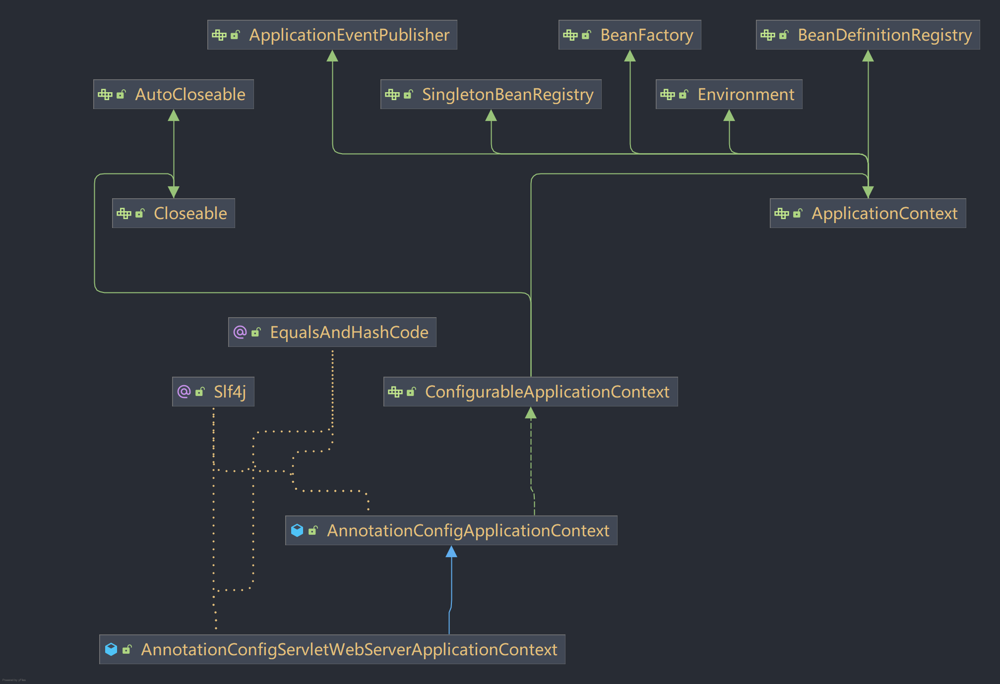

# AutumnFramework
对Spring的拙劣的模仿


## 写在前面的话:
- `AutumnFramework模仿了SpringBoot的部分基本特性,但在底层实现上却大有不同,因此仅作为一个兴趣驱动的展示项目`
- 框架主体是作者在大三实习的时候完成的,所以`不是一个成熟的项目,不会进行过多防御性编程`,源码中只会助力于功能的实现而不会对过于复杂的情况进行额外处理
- 从0开始手写React的计划也开始了,已实现简单的`React Fiber + Hooks`(已在项目中使用)


## 推荐:
- [MiniReact:简单的React仿写](https://github.com/ziyuan123456789/mini-react)
- [MiniReact在线体验(如果打开白屏请F5刷新页面)](https://ziyuan123456789.github.io/)
- [MineBatis:简单的Mybatis仿写](https://github.com/ziyuan123456789/MineBatis)


## 注意事项:
- 目前仅支持调用字段的无参默认构创建实例,原则上来说构造器注入也实现了,但问题太多难以维护,不在代码中启用.另外构造器注入会让三级缓存部分失效,因为解决循环依赖的核心是
  `创建对象`与`注入对象`分离,但构造器让这一步`不可分割`,使用`代理模式`这种丑陋的方式解决又不太好,`Setter`注入感觉又多此一举
- 如果你希望使用自动装配机制则需要在主类上加入`@EnableAutoConfiguration`或者`@AutumnBootApplication`来告知框架进行自动装配


## 启动类
```java
@Slf4j
@EnableAutumnAsync
@EnableAutumnCache
@EnableAutumnTransactional
@EnableMVCAutoConfiguration
@ComponentScan({"org.example", "annotation.scan.test"})
@AutumnBootApplication
public class Main {

  public static void main(String[] args) {
    AutumnApplication autumnApplication = new AutumnApplication(Main.class);
    //        autumnApplication.addInitializers(new BaseBootstrapRegistryInitializer());
    autumnApplication.run(args);
  }

  @MyPreDestroy
  public void sayBye() {
    log.info("再见孩子们");
  }
}

```

## 生命周期

### AutumnApplication构造方法:

```java
//在构造方法中确定了扫描的起点以及推断真正的程序入口,并对SPI机制进行初始化,从Meta-INF目录下读取配置文件,进行实例化
public AutumnApplication(Class<?>... primarySources) {

  //确定应用的主要配置来源,为Bean扫描的起点
  this.primarySources = new LinkedHashSet<>(Arrays.asList(primarySources));
  
  /**
   读取默认的BootstrapRegistryInitializer实现类,可以预注册组件,调用构造器创建实例对象
   在 ApplicationContext 准备就绪 但尚未refresh之前,提供一个回调入口 对这个 ApplicationContext 实例本身进行编程化的修改和配置
   一般而言可以用来动态加载一些配置
   */
  this.bootstrapRegistryInitializers = this.getAutumnFactoriesInstances(BootstrapRegistryInitializer.class);

  //读取默认的ApplicationContextInitializer实现类,可以修改 ApplicationContext,在Context创建后启用
  this.setInitializers(this.getAutumnFactoriesInstances(ApplicationContextInitializer.class));

  //注册监听器
  this.setListeners(this.getAutumnFactoriesInstances(ApplicationListener.class));

  //依照调用栈回溯到main方法,确定应用入口
  this.mainApplicationClass = deduceMainApplicationClass();

  //检查是否开启了编译参数,以便获取方法的真正参数名
  this.checkEnv();
}
```

### AutumnApplication中的run方法:

```java
public void run(String[] args) {

  //初始化命令行参数
  this.sysArgs = args;

  //创建DefaultBootstrapContext,在context没有创建之前提供一个容器,创建引导上下文
  DefaultBootstrapContext bootstrapContext = this.createBootstrapContext();

  //发布start事件
  List<AutumnApplicationRunListener> listeners = getAutumnFactoriesInstances(AutumnApplicationRunListener.class);
  for (AutumnApplicationRunListener listener : listeners) {
    listener.starting(bootstrapContext, mainApplicationClass);
  }

  //包裹命令行/jvm/其他参数
  ApplicationArguments applicationArguments = new DefaultApplicationArguments(args);

  //初始化环境配置,例如把主包,主类,主源进行写入保存,准备环境
  environment = prepareEnvironment(listeners, bootstrapContext, applicationArguments);

  //依照配置创建beanFactory,默认为`AnnotationConfigServletWebServerApplicationContext`
  beanFactory = createApplicationContext();

  // 准备上下文
  prepareContext(bootstrapContext, beanFactory, environment, listeners, applicationArguments);

  // 刷新上下文
  refreshContext((AnnotationConfigApplicationContext) beanFactory);

}
```

### ApplicationContext中的refresh方法:

```java
@Override
public void refresh() {
  //刷新前的准备,记录当前时间戳
  prepareRefresh();

  //BeanFactory前准备
  prepareBeanFactory(this);

  try {
    //模板方法
    postProcessBeanFactory(this);

    //调用BeanFactory后置处理器,因为 ConfigurationClassPostProcessor 的存在,绝大部分Bean定义包装完成
    invokeBeanFactoryPostProcessors();

    //注册实例化Bean后置处理器
    registerBeanPostProcessors(this);

    //初始化事件广播器
    initApplicationEventMulticaster();

    //模板方法, Web容器初始化
    onRefresh();

    //注册监听器
    registerListeners();

    //实例化所有的Bean
    finishBeanFactoryInitialization(this);

    //刷新完成
    finishRefresh();

  } catch (Exception e) {
    log.error(ANSI_RED + "容器刷新失败: " + e.getMessage() + ANSI_RESET, e);
    throw new RuntimeException(e);
  }
}

```

## MVC章节
### Controller

控制器支持Url传参注入,以及SessionAttribute注入,以及PathVariable注入
支持类级别与方法级别的RequestMapping

```java
import com.autumn.mvc.AutumnNotBlank;
import com.autumn.mvc.CrossOrigin;
import com.autumn.mvc.ErrorHandler;
import com.autumn.mvc.GetMapping;
import com.autumn.mvc.PathVariable;
import com.autumn.mvc.PostMapping;
import com.autumn.mvc.SessionAttribute;
import lombok.extern.slf4j.Slf4j;
import org.example.FrameworkUtils.AutumnCore.Annotation.Lazy;
import org.example.FrameworkUtils.AutumnCore.Annotation.MyAutoWired;
import org.example.FrameworkUtils.AutumnCore.Annotation.MyController;
import org.example.FrameworkUtils.AutumnCore.Annotation.MyRequestMapping;
import org.example.FrameworkUtils.Orm.MyRedis.MyRedisTemplate;
import org.example.FrameworkUtils.WebFrameworkBaseUtils.MyServers.AutumnRequest;
import org.example.FrameworkUtils.WebFrameworkBaseUtils.MyServers.AutumnResponse;

@Slf4j
@MyController
@MyRequestMapping("/api")
@CrossOrigin("http://localhost:8080")
public class AutumnHttpServerController {

  @MyAutoWired
  @Lazy
  private MyRedisTemplate myRedisTemplate;

  @MyAutoWired
  private AutumnRequest autumnRequest;

  @MyAutoWired
  private AutumnResponse autumnResponse;

  //测试GetMapping
  @GetMapping
  @MyRequestMapping("/getMappingTest")
  public String getMappingTest() {
    return "GetMapping测试成功";
  }

  //测试PostMapping
  @PostMapping
  @MyRequestMapping("/postMappingTest")
  public String postMappingTest() {
    return "PostMapping测试成功";
  }

  //测试session功能
  @MyRequestMapping("/")
  public String setSession(AutumnRequest myRequest) {
    String sessionId = myRequest.getSession().getSessionId();
    myRequest.getSession().setAttribute("id", sessionId);
    return "切换阅览器查看唯一标识符是否变化? 标识符如下:" + myRequest.getSession().getAttribute("id");
  }


  //测试sessionAttribute
  @MyRequestMapping("/attribute")
  public String sessionAttributeTest(@SessionAttribute(name = "id") String id) {
    return id;
  }


  //测试路径传参
  @MyRequestMapping("/test/{sn}")
  public String pathVariable(@PathVariable("sn") String sn) {
    return sn;
  }

  //测试参数注入
  @MyRequestMapping("/paramTest")
  public String paramTest(String name, String age) {
    return name + "+" + age;
  }


  //测试ErrorHandler以及AutumnNotBlank与AutumnNotBlank
  @ErrorHandler(errorCode = 400, title = "参数校验异常")
  @MyRequestMapping("/notnull")
  public String notNullOrBlankTest(@AutumnNotBlank String id, @AutumnNotBlank String name) {
    return id + "+" + name;
  }

  //测试全局request功能
  @MyRequestMapping("/request")
  public String requestTestWithField() {
    log.info(myRedisTemplate.getClass().toString());
    log.info("{}{}{}", autumnRequest.getUrl(), autumnRequest.getMethod(), autumnRequest.getParameters());
    return autumnRequest.getUrl() + autumnRequest.getMethod() + autumnRequest.getParameters();
  }

  //测试方法级request功能
  @MyRequestMapping("/requestmethod")
  public String requestTestWithMethodParma(AutumnRequest res) {
    log.info("{}{}{}", res.getUrl(), res.getMethod(), res.getParameters());
    return res.getUrl() + res.getMethod() + res.getParameters();
  }


  //测试response与setCookie功能
  @MyRequestMapping("/response")
  public void responseTest(AutumnResponse myResponse) {
    Cookie cookie = new Cookie("newcookie", "session1");
    myResponse.setCode(200)
            .setCookie(cookie)
            .setView(new View("AutumnFrameworkMainPage.html"))
            .outputHtml();
  }


  //测试View层功能
  @MyRequestMapping("/html")
  public View myhtml() {
    return new View("AutumnFrameworkMainPage.html");
  }
}

```
### 拦截器
```java
@Slf4j
@MyComponent
public class UrlFilter implements Filter, Ordered {

  @MyAutoWired
  private IndexFilter indexFilter;

  @Override
  public boolean doChain(AutumnRequest autumnRequest, AutumnResponse autumnResponse) {
    if ("GET".equals(autumnRequest.getMethod())) {
      log.info("一级过滤链拦截,开始第一步鉴权");
//            myResponse.setCode(401).setResponseText("鉴权失败").outputErrorMessage();
      return indexFilter.doChain(autumnRequest, autumnResponse);
    } else {
      log.info("一级过滤链放行");
      return false;
    }
  }

  @Override
  public int getOrder() {
    return 100;
  }
}
```

### WebSocket

```java

@Slf4j
@MyWebSocketEndpoint("/WebSocket")
public class WebSocketController implements WebSocketEndpoint {


    @Override
    public void onOpen() {
        log.warn("切换到WebSocket");
    }

    @Override
    public void onClose() {
        log.warn("用户离开");
    }

    @Override
    public String onMsg(String text) {
        log.info("接受的讯息为{}", text);
        return text;
    }
}

```

### 自动装配机制

```java

@Target({ElementType.TYPE})
@Inherited
@Retention(RetentionPolicy.RUNTIME)
@Import(AutoConfigurationImportSelector.class)
public @interface EnableAutoConfiguration {

}
```

借助AutoConfigurationImportSelector这个ImportSelector,可在ConfigurationClassPostProcessor阶段接管
读取Meta-INF/autumn/AutoConfiguration.imports文件,获取自动装配的类,进行条件判断后进行生产

### 整合Minebatis

```java
import com.autumn.ormstarter.MineBatisStarter;
import com.autumn.ormstarter.SqlSessionFactoryBean;
import lombok.extern.slf4j.Slf4j;
import org.example.FrameworkUtils.AutumnCore.Annotation.AutumnBean;
import org.example.FrameworkUtils.AutumnCore.Annotation.Import;
import org.example.FrameworkUtils.AutumnCore.Annotation.MyConfig;
import org.example.FrameworkUtils.AutumnCore.Aop.JokePostProcessor;@MyConfig
@Slf4j
@Import({SqlSessionFactoryBean.class, JokePostProcessor.class})
public class MineBatisAutoConfiguration {

    @AutumnBean
    public MineBatisStarter createMineBatisStarter() {
        return new MineBatisStarter();
    }

}
```

```java
public interface UserMapper {
    List<User> getOneUser(Integer userId);
    List<User> getAllUser(Integer userId);
    User checkUser(String userId, String password);
}
```

```java
public interface UpdateMapper {
  int insertUser(String username, String role, String password, String Salt);

  int updateUserById(String username, String role, String password, Integer userID);

  int deleteUserById(Integer userId);
}

```
```xml
<mapper namespace="org.example.mapper.UserMapper">
    <select id="getOneUser" resultMap="whyYouDoThis" parameterType="java.lang.Integer">
        SELECT UserID as testUserID,
        Username as testUserName,
        Role,
        `Password`,
        Salt,
        Telephone,
        regTime,
        enabled
        FROM `user`
        where UserId > #{userId}
    </select>

    <select id="getAllUser" resultType="org.example.Bean.User"
            parameterType="java.lang.Integer">
        select * from user  where UserId > #{userId}
    </select>

    <resultMap id="whyYouDoThis" type="org.example.Bean.User" isDisable="false">
        <result property="userID" column="testUserID"/>
        <result property="username" column="testUserName"/>
    </resultMap>

    <select id="checkUser" resultType="org.example.Bean.User">
        select * from user u where Username=#{userId} and Password=#{password}
    </select>
</mapper>
```

```xml

<mapper namespace="org.example.mapper.UpdateMapper">
  <insert id="insertUser" parameterType="java.lang.String">
    INSERT INTO user (username, role, password,Salt)
    VALUES (#{username}, #{role}, #{password},#{Salt})
  </insert>

  <update id="updateUserById" parameterType="java.lang.String">
    UPDATE user
    SET username = #{username}, role = #{role}, password = #{password}
    WHERE userID = #{userID}
  </update>


  <delete id="deleteUserById" parameterType="java.lang.Integer">
    DELETE FROM user WHERE UserId = #{userId}
  </delete>
</mapper>
```

### 事务

首先你需要引入`@EnableAutumnTransactional`注解来开启事务服务,检测到复合注解后会自动引入其他依赖

接着在需要的方法上声明`@AutumnTransactional` 框架便会进行代理自动接管事务

事务传播机制实现了

```text
REQUIRED
REQUIRES_NEW
```

在如下的代码中可以看到事务的使用,当声明为 `REQUIRED` 时候，存在现成的事务则加入,没有则新建

注意:即使你在父方法中进行了 `异常捕获` 但依然会造成 `整个大事务回滚`

如果声明为 `REQUIRES_NEW` 则另起炉灶,从连接池取出一个新的连接,拥有隔离的上下文  
`REQUIRES_NEW` 的崩溃不会导致其他事务的回滚,但如果你没有捕获异常那就另说了  
事务的默认捕获范围为`RuntimeException` 如果你想捕获`受检异常` 请在注解上声明
`rollbackFor = Exception.class/Throwable.class`

直接调用方法与this.method 会导致事务失效
如果你在同一个类声明了多个事务方法，需要进行 `自注入` 以保证拿到的是代理类

```text
┌──->──┐
|  transactionService
└──<-──┘
```

```java
@MyService
public class TransactionImplService implements TransactionService {
    
    @MyAutoWired
    private UpdateMapper updateMapper;

    @MyAutoWired
    private TransactionService transactionService;

    @Override
    @AutumnTransactional(rollbackFor = Exception.class,
            propagation = Propagation.REQUIRED,
            isolation = Isolation.DEFAULT
    )
    public String transactionTest() throws SQLException {
        updateMapper.insertUser("1", "1", "1", "1");
        try {
            transactionService.transactionRequireNew();
        } catch (Exception e) {

        }
        return "OK";
    }

    @Override
    @AutumnTransactional(propagation = Propagation.REQUIRES_NEW)
    public void transactionRequire() throws SQLException {
        updateMapper.insertUser("2", "2", "2", "2");
        throw new RuntimeException("测试");
    }

    @Override
    @AutumnTransactional(rollbackFor = Exception.class)
    public void transactionRequireNew() throws SQLException {
        updateMapper.insertUser("2", "2", "2", "2");
        throw new RuntimeException("测试");
    }

}
```

ORM与框架为互相隔离的状态,ORM感知不到框架的存在,框架也不会感知到ORM的存在  
事务本身由手搓的 ORM 提供,框架本身是上层服务调用方.如果你希望使用其他的 ORM 请自己写适配器,保证可以主动注册到事务管理器中

### Service层,你可以选择注入实现类或声明接口,框架会为你注入合适地实现类
```java
public interface LoginService {
    boolean checkLogin(String userid, String password);
}

@MyService
public class LoginServiceImpl implements LoginService {
    @MyAutoWired
    UserMapper userMapper;

    @Override
    public boolean checkLogin(String userId, String password) {
        return userMapper.checkUser(userId, password) != null;
    }
}
```
### WebSocket握手 目前仅支持SocketServer运行环境
```java
@MyRequestMapping("/websocketTest")
public MyWebSocket websocketTest(){
    //websocket初始化工作
    return new MyWebSocket();
}
```
### WebSocket处理器
```java
@MyWebSocketConfig("/websocketTest")
@Slf4j
public class WebSocketController implements WebSocketBaseConfig {

    @Override
    public void onOpen() {
        log.warn("切换到WebSocket");
    }

    @Override
    public void onClose() {
        log.warn("用户离开");
    }

    @Override
    public String onMsg(String text) {
        log.info("接受的讯息为"+text);
        return text;
    }
}
```
### 自定Converter

使用`@Inject`注解标记一个类并实现`ControllerInjector`接口,就可以注入一个自定义注入器,来指导Controller方法参数的注入
例如下面这个例子,我们使用自定义注入器指导框架去正确处理并注入一个枚举
```java
@MyRequestMapping("/inject")
public String injectTest(ColorMappingEnum color) {
    return color.getColorName();
}

@ErrorHandler(errorCode = 400, title = "参数校验异常")
@MyRequestMapping("/notnull")
public String notNullOrBlankTest(@AutumnNotBlank String id, @AutumnNotBlank String name) {
  return id + "+" + name;
}

```

### Web容器选择 如果你喜欢可以自行加入Jetty的适配器 可依靠条件注解实现无缝的容器切换
```java

@Slf4j
@MyComponent
public class TomCatContainer implements MyWebServer, ApplicationListener<ContextFinishRefreshEvent>, EnvironmentAware {

  private int port;

  @MyAutoWired
  private DispatcherServlet dispatcherServlet;

  @Override
  public void init() throws Exception {
    log.info("切换到TomCat容器");
  }


  @Override
  public void onApplicationEvent(ContextFinishRefreshEvent event) {
    new Thread(() -> {
      try {
        Tomcat tomcat = new Tomcat();
        Connector connector = new Connector();
        connector.setPort(port);
        connector.setURIEncoding("UTF-8");
        tomcat.getService().addConnector(connector);
        Context context = tomcat.addContext("/", null);
        Tomcat.addServlet(context, "dispatcherServlet", dispatcherServlet);
        context.addServletMappingDecoded("/", "dispatcherServlet");
        tomcat.start();
        log.info("服务于{}端口启动", port);
        log.info("http://localhost:{}/", port);
        tomcat.getServer().await();
      } catch (LifecycleException e) {
        throw new RuntimeException(e);
      }
    }).start();

  }

  @Override
  public boolean supportsEvent(ApplicationEvent event) {
    return event instanceof ContextFinishRefreshEvent;
  }


  @Override
  public void setEnvironment(Environment environment) {
    this.port = Integer.parseInt(environment.getProperty("port"));
  }
}

```

## 代码示范 AOP章节
### AOP
```java
@Slf4j
@MyAspect
public class UserAopProxyHandler implements AutumnAopFactory {
  @Override
  public boolean shouldNeedAop(Class clazz, AutumnBeanFactory myContext) {
    return clazz.getAnnotation(MyService.class) != null;

  }

  @Override
  public boolean shouldIntercept(Method method, Class clazz, AutumnBeanFactory myContext) {
    return true;
  }

  @Override
  public void doBefore(Object obj, Method method, Object[] args) {
    log.warn("用户切面方法开始预处理,切面处理器是{}处理的方法为:{}", this.getClass().getSimpleName(), method.getName());
    log.info("检查注解");
    Annotation[][] paramAnnotations = method.getParameterAnnotations();
    for (int i = 0; i < paramAnnotations.length; i++) {
      for (Annotation annotation : paramAnnotations[i]) {
        if (annotation.annotationType().equals(CheckParameter.class)) {
          log.error("参数{}被拦截", args[i].getClass().getSimpleName());
          args[i] = "AopCheck";
        }
      }
    }
  }


  @Override
  public void doAfter(Object obj, Method method, Object[] args) {
    log.info("用户自定义逻辑执行结束");
  }

  @Override
  public void doThrowing(Object obj, Method method, Object[] args,Exception e) {
    log.error("用户切面方法抛出异常",e);
  }
}
```

## 代码示范 Async章节

### 开启异步服务

用户需要引入@EnableAutumnAsync注解开启异步服务

```java
@EnableAutumnAsyn
```

### 标记异步方法

使用@Async标记方法

```java

@MyService
@Slf4j
public class AsyncServiceImpl implements AsyncService {
  @Async
  @Override
  public void asyncTest() {
    log.info("方法调用");
    try {
      Thread.sleep(10000);
      System.out.println("asyncTest");
    } catch (Exception e) {

    }

  }
}
```

### 使用方法

异步底层使用Aop+线程池把方法挪到线程池运行,返回一个Task,您需要依赖注入这个包含异步方法的类

注意:`异步方法使用事务会存在问题`,因为事务的底层依靠`ThreadLocal`而异步方法并不在主线程运行,所以事务的上下文无法传递到异步方法中

```java

@MyAutoWired
private AsyncService asyncService;

//测试异步能力
@MyRequestMapping("/async")
public String asyncTest() {
  asyncService.asyncTest();
  return "异步测试";
}
```

## 代码示范  Bean生命周期以及拓展接口章节
### 自动装配机制:自定义后置处理器干预Bean定义生成
你可以选择在resources文件夹下建立META-INF/autumn/`AutoConfiguration.imports` 文件,声明自动装配依赖的类.框架会自动扫描并创建依赖,同时Jar包下的相同路径也会被扫描
```text
BeanDefinitionRegistryPostProcessor=com.autumn.ormstarter.MineBatisStarter
BeanFactoryPostProcessor=org.example.FrameworkUtils.AutumnCore.Aop.JokePostProcessor
Beans=com.autumn.ormstarter.SqlSessionFactoryBean
```
你可以选择使用上述的`AutumnSpi`来导入对应的依赖,也可也使用`Import机制`来连锁导入需要的类,就像SpringBoot那样,添加一个注解开启服务,这个注解为一个复合注解,背后真正有用的元信息的还是`@Import`注解
```java
@Target({ElementType.TYPE})
@Retention(RetentionPolicy.RUNTIME)
@Inherited
@Import({AutumnAsyncConfiguration.class, AsyncAopProxyHandler.class})
public @interface EnableAutumnAsync {
}
```
```java
@Slf4j
@Import({SqlSessionFactoryBean.class, JokePostProcessor.class})
public class MineBatisStarter implements BeanDefinitionRegistryPostProcessor, PriorityOrdered{}
```

#### 利用这个后置处理器,我们可以扫描Mapper把他们也纳入容器,同时生成代理类
```java
@Slf4j
@Import({SqlSessionFactoryBean.class, JokePostProcessor.class})
public class MineBatisStarter implements BeanDefinitionRegistryPostProcessor, EnvironmentAware, PriorityOrdered, BeanFactoryAware {


  private ApplicationContext beanFactory;

  private Environment environment;

  static {
    Properties p = new Properties(System.getProperties());
    p.put("com.mchange.v2.log.MLog", "com.mchange.v2.log.FallbackMLog");
    p.put("com.mchange.v2.log.FallbackMLog.DEFAULT_CUTOFF_LEVEL", "OFF");
    System.setProperties(p);
  }

  @Override
  public void postProcessBeanFactory(AnnotationScanner scanner, BeanDefinitionRegistry registry) throws Exception {

  }


  @Override
  public void postProcessBeanDefinitionRegistry(AnnotationScanner scanner, BeanDefinitionRegistry registry) throws Exception {
    String minebatisXml = environment.getProperty("MineBatis-configXML");
    InputStream inputStream;
    if (minebatisXml == null || minebatisXml.isEmpty()) {
      inputStream = Resources.getResourceAsSteam("minebatis-config.xml");
    } else {
      inputStream = Resources.getResourceAsSteam(minebatisXml);
    }
    SqlSessionFactory sqlSessionFactory = new SqlSessionFactoryBuilder().build(inputStream);
    inputStream.close();
    Set<Class<?>> classSet = sqlSessionFactory.getConfiguration().getMapperLocations();
    for (Class<?> clazz : classSet) {
      MyBeanDefinition myBeanDefinition = new MyBeanDefinition();
      log.warn("{}包装Mapper:{}", this.getClass().getSimpleName(), clazz.getName());
      myBeanDefinition.setName(clazz.getName());
      myBeanDefinition.setBeanClass(MapperFactoryBean.class);
      myBeanDefinition.setConstructor(MapperFactoryBean.class.getDeclaredConstructor(Class.class));
      Object[] parameters = new Object[]{clazz};
      myBeanDefinition.setParameters(parameters);
      registry.registerBeanDefinition(clazz.getName(), myBeanDefinition);
    }

    AnnotationScanner.findAnnotatedClasses(environment.getProperty(Environment.GET_MAIN_PACKAGE), TypeHandler.class).forEach(typeHandler -> {
      MyBeanDefinition myBeanDefinition = new MyBeanDefinition();
      myBeanDefinition.setName(typeHandler.getName());
      myBeanDefinition.setBeanClass(typeHandler);
      registry.registerBeanDefinition(typeHandler.getName(), myBeanDefinition);
    });
  }

  @Override
  public int getOrder() {
    return 4;
  }


  @Override
  public void setBeanFactory(ApplicationContext beanFactory) {
    this.beanFactory = beanFactory;
  }

  @Override
  public void setEnvironment(Environment environment) {
    this.environment = environment;
  }
}
```

### BeanPostProcessor 在Bean创建完整前后提供拓展
```java
@MyComponent
@Slf4j
public class UserBeanPostProcessor implements BeanPostProcessor, Ordered {
    @Override
    public Object postProcessBeforeInitialization(Object bean, String beanName) {
        log.info("before -- {}", beanName);
        return bean;
    }

    @Override
    public Object postProcessAfterInitialization(Object bean, String beanName){
        log.info("after -- {}", beanName);
        return bean;
    }
}
```

### FactoryBean 用于创建复杂的Bean 
```java
@Data
@Slf4j
public class SqlSessionFactoryBean implements FactoryBean<SqlSessionFactory>, BeanFactoryAware, BeanNameAware {

  private ApplicationContext beanFactory;


  @Override
  public SqlSessionFactory getObject() throws Exception {
    SqlSessionFactoryBuilder builder = new SqlSessionFactoryBuilder();
    String minebatisXml = beanFactory.getProperties().getProperty("MineBatis-configXML");
    InputStream inputStream;
    if (minebatisXml == null || minebatisXml.isEmpty()) {
      inputStream = Resources.getResourceAsSteam("minebatis-config.xml");
    } else {
      inputStream = Resources.getResourceAsSteam(minebatisXml);
    }
    SqlSessionFactory sqlSessionFactory = builder.build(inputStream);
    inputStream.close();
    return sqlSessionFactory;

  }

  @Override
  public Class<?> getObjectType() {
    return SqlSessionFactory.class;
  }

  @Override
  public void setBeanFactory(ApplicationContext beanFactory) {
    this.beanFactory = beanFactory;
  }

  @Override
  public void setBeanName(String beanName) {
    log.info("我在IOC里的名字为:{}", beanName);
  }
}
```

```java
public class MapperFactoryBean<T> implements FactoryBean<T> {

  private final Class<T> mapperInterface;

  @MyAutoWired
  private SqlSessionFactory sqlSessionFactory;

  // 整个项目唯一的构造器注入,不过请注意此处能注入成功是因为在BeanDefinitionRegistryPostProcessor中手动指定了构造器参数,才可以成功创建对象
  @MyAutoWired
  public MapperFactoryBean(Class<T> mapperInterface) {
    this.mapperInterface = mapperInterface;
  }

  @Override
  public T getObject() throws Exception {
    SqlSession sqlSession = sqlSessionFactory.openSession();
    return sqlSession.getMapper(mapperInterface);
  }

  @Override
  public Class<?> getObjectType() {
    return this.mapperInterface;
  }

}
```
### 配置类 @Bean
```java
@MyConfig
@Slf4j
public class BeanTestConfig {
    @AutumnBean("BYD")
    public Car giveMeBydCar() {
      Car car = new Car();
      car.setName("BYD");
      return car;
    }

  @AutumnBean(value = "WenJie", initMethod = "initMethod", destroyMethod = "destroyMethod")
    public Car giveMeWenJieCar(){
    Car car = new Car();
    car.setName("WenJie");
    return car;
    }
}

@Data
@Slf4j
public class Car implements InitializingBean {
    private String name;

  @MyPostConstruct
    public void init() {
    log.info(" {}  孩子们,我复活了", name);
    }

  @MyPreDestroy
    public void destroy() {
    log.warn(" {} 孩子们,我的时间不多了", name);
  }

  public void initMethod() {
    log.info(" {} 中的initMethod调用", name);
    }

  public void destroyMethod() {
    log.info(" {} 中的destroyMethod调用", name);
  }

  @Override
  public void afterPropertiesSet() {
    log.info(" {} 中的afterPropertiesSet调用", name);
  }
}
```
### 条件注解
```java
@MyService
@MyConditional(MatchClassByInterface.class)
public class AutumnMvcConfigurationBaseImpl implements AutumnMvcConfiguration{
    @Value("baseHtml")
    String baseHtml;

    @Value("404Html")
    String notFoundPage;
    @Override
    public View getMainPage() {
        return new View(baseHtml);
    }

    @Override
    public View get404Page() {
        return new View(notFoundPage);
    }
}
```


### 配置文件
```html
url=jdbc:mysql://localhost:3306/demo?serverTimezone=UTC&useUnicode=true&characterEncoding=utf-8&useSSL=false&allowPublicKeyRetrieval=true
user = root
password=root
port=80
cookieKeepTime=180000
threadPoolNums=10
htmlHome=HTML
iconHome=Icon
baseHtml=AutumnFrameworkMainPage.html
404Html=404.html
iconName=myicon.ico
crossOrigin=*
redisHost=127.0.0.1
redisPort=6379
allow-circular-references=true
MineBatis-configXML=minebatis-config.xml
```

### 项目依赖
```
- TomCat 内嵌了一个TomCat,如果你不希望用我写的SocketHttpServer只需要把条件处理器的逻辑改了即可启动TomCat接管网络服务
- c3p0 数据库连接池
- jaxen,dom4j xml解析工具库
- Jedis 
- Spring-core(Cglib) Spring重写的Cglib,用于实现Aop
- Lombok 
- Reflections 注解扫描库
- Mysql-connector-java 
- Slf4j-api
- Logback-classic 实现彩色日志
```

### 容器继承图

<div style="text-align: center;">
    
</div>


## 更长远的想法:
- 支持https

## 人生目标:
- ~~找个美女对象(即将实现)(已经黄了)~~

## 人生忠告:
- 技术没什么意义,多发展一下自己在生活中的兴趣爱好,人格的均衡发展才是硬道理
- 远离infp女生
- 远离情绪黑洞


### 感谢

- B站
  - Java小小刀
  - 猿人林克

- 实体书籍
  - 图灵图书: 《图解HTTP》
  - 异步图书：《Spring Boot源码解读与原理分析》
  - 机械工业出版社：《看透Spring MVC源代码分析与实践》 《JavaScript权威指南》
  - 异步图书：《Effective Java》
  - 黑皮书系列：《Java编程思想》、《计算机网络》


- IDE/插件/AI
  - **Jetbrains** 提供的开源支持：IDEA / PyCharm / Rider / CLion License
  - **GitHub** 提供的学生免费 Copilot
  - **Google** Gemini 2.5Pro GPT-5

