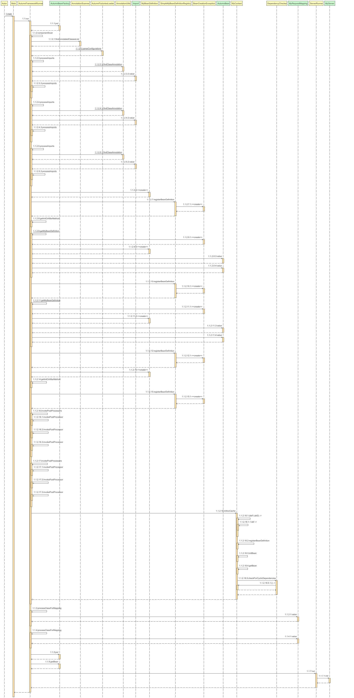

# AutumnFramework
对Spring的拙劣的模仿


## 写在前面的话:

- `AutumnFramework模仿了SpringBoot的部分基本特性,但在底层实现上却大有不同,因此仅作为一个兴趣驱动的展示项目`
- 框架主体是作者在大三实习的时候完成的,所以`不是一个成熟的项目,不会进行过多防御性编程`,源码中只会助力于功能的实现而不会对过于复杂的情况进行额外处理
- 从0开始手写React的计划也开始了,已实现一版简单的`React Fiber + Hooks`(已在项目中使用)

## 推荐:
- [MiniReact:简单的React仿写](https://github.com/ziyuan123456789/mini-react)

## 重构通知:

由于实现了复合注解以及自动装配,一切SpringBoot需要引入Starter的功能均会被剥离出去,成为单独的组件,使用AutumnSpi等机制自动引入

目前已经实现的Starter如下:

- MineBatis
- Async异步处理
- Cache
- Transaction

已拓展但未使用Spi/Import机制的如下:

- Swagger
- Web
- ControllerInject

已经在设计的如下:

- ControllerAdvice


## 近期准备更新的内容:
- Controller直接注入对象
- 尝试手写TomCat 命名为Jerry mouse
- 对启动类进行完整的重写,按照SpringBoot的初始化方式进行启动
- 对IOC容器进行完整重构

## 注意事项:

- 现在框架Web环境有两种分别为SocketServer与TomCat,默认是SocketServer,如果你想用内嵌的TomCat请自行找到切换的开关
- 目前仅支持调用字段的无参默认构创建实例,原则上来说构造器注入也实现了,但问题太多难以维护,不在代码中启用.另外构造器注入会让三级缓存部分失效,因为解决循环依赖的核心是
  `创建对象`与`注入对象`分离,但构造器让这一步`不可分割`,只能使用`代理模式`这种丑陋的方式解决
- 框架只负责对框架注解标记的类以及自动装配机制引入的类进行管理,用户可编写自己的后置处理器干预BeanDefinition的生产
- 如果你希望使用自动装配机制则需要在主类上加入`@EnableAutoConfiguration`注解来告知框架进行自动装配
- 如果想实现Mybatis那样`扫描自定义注解`扫描为组件,则需要声明为postProcessBeanDefinitionRegistry
- MineBatis现在只可以注册XmlMapper,注解注册的方式日后添加
- 想使用注解处理器先执行`mvn install:install-file -Dfile=src/main/resources/libs/AutumnAnP.jar -DgroupId=org.AutumnAP -DartifactId=AutumnAnP -Dversion=1.0-SNAPSHOT -Dpackaging=jar `再执行`mvn clean install`

## 实验性内容:
- 现在框架加入了一个`编译期`注解`@EnableAutumnFramework`,你只需要在主类上加入它然后一行代码也不用写,留一个空的main方法程序就会开始执行,想试试的改下pom文件开启

## 项目描述:
不依赖TomCat,Servlet等技术实现的网络服务框架,参照了Mybatis,SpringMvc等设计思想从0手写了一个基于注解的仿SpringBoot框架


## Bean的生命周期

```
1. Bean定义阶段：
   组件扫描与Bean定义注册：自动检测并注册带注解的组件
   处理BeanDefinitionRegistryPostProcessor和BeanFactoryPostProcessor：修改Bean定义或注册表的结构
2. 实例化前处理：
   doInstantiationAwareBeanPostProcessorBefore: 允许在实际实例化前修改或代理Bean
3. 实例化后处理：
   doInstantiationAwareBeanPostProcessorAfter: 在实例化后决定是否继续Bean的处理流程
4. BeanFactory/Name Aware处理：
   BeanFactoryAware: 在依赖注入前为Bean注入BeanFactory
5. 依赖注入：
   autowireBeanProperties: 自动装配Bean的依赖属性
6. 初始化前处理：
   doBeanPostProcessorsBefore: 在自定义初始化方法之前对Bean进行处理
7. 自定义初始化方法：
   执行初始化方法：执行Bean的自定义初始化方法
8. 初始化后处理：
   doBeanPostProcessorsAfter: 在自定义初始化方法之后进行处理
9. 循环依赖检测：
   循环依赖检测：确保没有循环依赖存在
10. 销毁方法的处理：
   销毁方法：在应用关闭时调用Bean的销毁方法
```

## 代码示范 启动类

```java
@EnableAutumnAsync
@EnableAutumnCache
@EnableAutumnTransactional
@AutumnBootApplication
@Slf4j
public class Main {
  public static void main(String[] args) {
    AutumnApplication autumnApplication = new AutumnApplication();
    autumnApplication.run(Main.class);
  }

  @MyPreDestroy
  public void sayBay() {
    log.info("再见孩子们");
  }
}


```
## 代码示范 MVC章节
### Controller
```java
@MyController
@Slf4j
public class AutumnTestController implements BeanFactoryAware {

  private ApplicationContext beanFactory;

  //测试配置文件注入器
  @Value("url")
  private String sqlUrl;

  //测试自身循环依赖
  @MyAutoWired
  private AutumnTestController autumnTestController;

  @MyAutoWired
  private LoginService loginService;

  @MyAutoWired
  private UserMapper userMapper;

  @MyAutoWired
  @Lazy
  private MyReidsTemplate myReidsTemplate;

  @MyAutoWired("postProcessChange")
  private Car car;

  @MyAutoWired
  private SqlSession sqlSession;

  @MyAutoWired
  private Test test;

  @MyAutoWired
  private AutumnRequest autumnRequest;

  @MyAutoWired
  private AutumnResponse autumnResponse;

  @MyAutoWired
  private AsyncService asyncService;

  @MyAutoWired
  private CacheTestService cacheTestService;

  @MyAutoWired
  private UpdateMapper updateMapper;

  @MyAutoWired
  private TransactionService transactionService;

  //测试事务
  @MyRequestMapping("/refresh")
  public void refresh() {
    beanFactory.refresh();
    log.warn("你有没有感觉到环境有点不一样了?");
  }

  //测试事务
  @MyRequestMapping("/transaction")
  public String transactionTest() throws SQLException {
    return transactionService.transactionTest();
  }


  //测试minebatis增删改查
  @MyRequestMapping("/crud")
  public Object crudKing(@MyRequestParam("method") String method) {
    return switch (method) {
      case "insert" -> updateMapper.insertUser("test", "0", "test", "收到");
      case "update" -> updateMapper.updateUserById("test1", "0", "test3", 1);
      case "delete" -> updateMapper.deleteUserById(1);
      default -> Integer.MAX_VALUE;
    };
  }

  //测试缓存组件
  @MyRequestMapping("/cache")
  public String cacheTest(String name) {
    return cacheTestService.cacheTest(name);
  }


  //测试自定义注入规则
  @MyRequestMapping("/inject")
  public String injectTest(ColorMappingEnum color) {
    return color.getColorName();
  }

  //测试异步能力
  @MyRequestMapping("/async")
  public String asyncTest() {
    asyncService.asyncTest();
    return "异步测试";
  }

  //测试全局request功能
  @MyRequestMapping("/request")
  public String requestTestWithField() {
    log.info(myReidsTemplate.getClass().toString());
    log.info("{}{}{}", autumnRequest.getUrl(), autumnRequest.getMethod(), autumnRequest.getParameters());
    return autumnRequest.getUrl() + autumnRequest.getMethod() + autumnRequest.getParameters();
  }

  //测试方法级request功能
  @MyRequestMapping("/requestmethod")
  public String requestTestWithMethodParma(AutumnRequest autumn) {
    log.info("{}{}{}", autumn.getUrl(), autumn.getMethod(), autumn.getParameters());
    return autumn.getUrl() + autumn.getMethod() + autumn.getParameters();
  }


  //测试response与setCookie功能
  @MyRequestMapping("/response")
  public void responseTest(AutumnResponse myResponse) {
    Cookie cookie = new Cookie("newcookie", "session1");
    myResponse.setCode(200)
            .setCookie(cookie)
            .setView(new View("AutumnFrameworkMainPage.html"))
            .outputHtml();
  }

  //测试参数注入
  @MyRequestMapping("/paramTest")
  public String paramTest(String name, String age) {
    return name + age;
  }

  //循环依赖测试
  @MyRequestMapping("/cycletest")
  public Map<String, Object> cycleTest() {
    return autumnTestController.mapTest();
  }

  //测试@Bean("BeanName")功能是否正常,同时看看Json解析器好不好用
  @MyRequestMapping("/map")
  public Map<String, Object> mapTest() {
    Map<String, Object> myMap = new HashMap<>();
    myMap.put("url", sqlUrl);
    log.info(car.toString());
    log.info(test.toString());
    return myMap;
  }

  //测试redis
  @MyRequestMapping("/redis")
  public String redis() {
    myReidsTemplate.init();
    myReidsTemplate.set("test", "test");
    return myReidsTemplate.toString() + "\n" + myReidsTemplate.get("test");
  }

  //测试View层功能
  @MyRequestMapping("/html")
  public View myhtml() {
    return new View("AutumnFrameworkMainPage.html");
  }


  //测试session功能
  @MyRequestMapping("/session")
  public String session(AutumnRequest myRequest) {
    String sessionId = myRequest.getSession().getSessionId();
    myRequest.getSession().setAttribute("name", sessionId);
    return "切换阅览器查看唯一标识符是否变化? 标识符如下:"+myRequest.getSession().getAttribute("name");
  }

  //测试WebSocket功能
  @MyRequestMapping("/websocket")
  public MyWebSocket websocketTest() {
    return new MyWebSocket();
  }

  //测试数据库功能
  @EnableAop
  @MyRequestMapping("/Login")
  public String login(@CheckParameter String userId,
                      String password) {
    if (loginService.checkLogin(userId, password)) {
      return "登录成功";

    } else {
      return "登录失败";
    }

  }

  //测试数据库功能
  @MyRequestMapping("/getall")
  public String getAll() {
    return userMapper.getAllUser(0).toString();
  }


  @Override
  public void setBeanFactory(ApplicationContext beanFactory) {
    this.beanFactory = beanFactory;
  }
}

```
### 拦截器
```java
@Slf4j
@MyComponent
@MyOrder(1)
public class UrlFilter implements Filter {
  @MyAutoWired
  IndexFilter indexFilter;

  @Override
  public boolean doChain(AutumnRequest autumnRequest, AutumnResponse autumnResponse) {
    if ("GET".equals(autumnRequest.getMethod())) {
      log.info("一级过滤链拦截,开始第一步鉴权");
//            myResponse.setCode(401).setResponseText("鉴权失败").outputErrorMessage();
      return indexFilter.doChain(autumnRequest, autumnResponse);
    } else {
      log.info("一级过滤链放行");
      return false;
    }
  }
}
```
### 整合Minebatis
```java
public interface UserMapper {
    List<User> getOneUser(Integer userId);
    List<User> getAllUser(Integer userId);
    User checkUser(String userId, String password);
}
```

```java
public interface UpdateMapper {
  int insertUser(String username, String role, String password, String Salt);

  int updateUserById(String username, String role, String password, Integer userID);

  int deleteUserById(Integer userId);
}

```
```xml
<mapper namespace="org.example.mapper.UserMapper">
    <select id="getOneUser" resultMap="whyYouDoThis" parameterType="java.lang.Integer">
        SELECT UserID as testUserID,
        Username as testUserName,
        Role,
        `Password`,
        Salt,
        Telephone,
        regTime,
        enabled
        FROM `user`
        where UserId > #{userId}
    </select>

    <select id="getAllUser" resultType="org.example.Bean.User"
            parameterType="java.lang.Integer">
        select * from user  where UserId > #{userId}
    </select>

    <resultMap id="whyYouDoThis" type="org.example.Bean.User" isDisable="false">
        <result property="userID" column="testUserID"/>
        <result property="username" column="testUserName"/>
    </resultMap>

    <select id="checkUser" resultType="org.example.Bean.User">
        select * from user u where Username=#{userId} and Password=#{password}
    </select>
</mapper>
```

```xml

<mapper namespace="org.example.mapper.UpdateMapper">
  <insert id="insertUser" parameterType="java.lang.String">
    INSERT INTO user (username, role, password,Salt)
    VALUES (#{username}, #{role}, #{password},#{Salt})
  </insert>

  <update id="updateUserById" parameterType="java.lang.String">
    UPDATE user
    SET username = #{username}, role = #{role}, password = #{password}
    WHERE userID = #{userID}
  </update>


  <delete id="deleteUserById" parameterType="java.lang.Integer">
    DELETE FROM user WHERE UserId = #{userId}
  </delete>
</mapper>
```
```xml
<configuration>
    <dataSource>
        <property name="driverClass" value="com.mysql.cj.jdbc.Driver"/>
        <property name="jdbcUrl"
                  value="jdbc:mysql://localhost:3306/demo?serverTimezone=UTC&amp;useUnicode=true&amp;characterEncoding=utf-8&amp;useSSL=false&amp;allowPublicKeyRetrieval=true"/>
        <property name="username" value="root"/>
        <property name="password" value="root"/>
    </dataSource>

    <mappers>
        <mapper resource="mapper/UserMapper.xml"/>
    </mappers>

    <myConfig>
    </myConfig>
</configuration>
```

如果你不想自动接管Mapper的生成,你也可以使用@Bean的方式注册一个SqlSession自己手动管理
```java
@AutumnBean
public SqlSession getMapper() {
    InputStream inputStream = Resources.getResourceAsSteam("minebatis-config.xml");
    SqlSessionFactory sqlSessionFactory = new SqlSessionFactoryBuilder().build(inputStream);
    return sqlSessionFactory.openSession();
}

@MyRequestMapping("/getall")
public String getAll() {
    UserMapper userMapperBean=sqlSession.getMapper(UserMapper.class);
    return userMapperBean.getAllUser(0).toString();
}
```

### 事务

首先你需要引入`@EnableAutumnTransactional`注解来开启事务服务,检测到复合注解后会自动引入其他依赖

接着在需要的方法上声明`@AutumnTransactional` 框架便会进行代理自动接管事务

事务传播机制实现了

```text
REQUIRED
REQUIRES_NEW
```

事务隔离实现了
```text
READ_UNCOMMITTED 
READ_COMMITTED
REPEATABLE_READ
SERIALIZABLE
```

在如下的代码中可以看到事务的使用,当声明为 `REQUIRED` 时候，存在现成的事务则加入,没有则新建

注意:即使你在父方法中进行了 `异常捕获` 但依然会造成 `整个大事务回滚`

如果声明为 `REQUIRES_NEW` 则另起炉灶,从连接池取出一个新的连接,拥有隔离的上下文  
`REQUIRES_NEW` 的崩溃不会导致其他事务的回滚,但如果你没有捕获异常那就另说了  
事务的默认捕获范围为`RuntimeException` 如果你想捕获`受检异常` 请在注解上声明
`rollbackFor = Exception.class/Throwable.class`

另外如果你在同一个类声明了多个事务方法，那么你依然需要进行 `自注入` 以保证拿到的是代理类,而不是这个被代理类本身,这一点与
Spring 保持一致 此外直接调用方法与this.method 效果是一样的,均会导致事务失效

```java
@MyService
public class TransactionImplService implements TransactionService {
    
    @MyAutoWired
    private UpdateMapper updateMapper;

    @MyAutoWired
    private TransactionService transactionService;

    @Override
    @AutumnTransactional(rollbackFor = Exception.class,
            propagation = Propagation.REQUIRED,
            isolation = Isolation.DEFAULT
    )
    public String transactionTest() throws SQLException {
        updateMapper.insertUser("1", "1", "1", "1");
        try {
            transactionService.transactionRequireNew();
        } catch (Exception e) {

        }
        return "OK";
    }

    @Override
    @AutumnTransactional(propagation = Propagation.REQUIRES_NEW)
    public void transactionRequire() throws SQLException {
        updateMapper.insertUser("2", "2", "2", "2");
        throw new RuntimeException("测试");
    }

    @Override
    @AutumnTransactional(rollbackFor = Exception.class)
    public void transactionRequireNew() throws SQLException {
        updateMapper.insertUser("2", "2", "2", "2");
        throw new RuntimeException("测试");
    }

}
```

ORM与框架为互相隔离的状态,ORM感知不到框架的存在,框架也不会感知到ORM的存在  
事务本身由手搓的 ORM 提供,框架本身是上层服务调用方.如果你希望使用其他的 ORM 请自己写适配器,保证可以主动注册到事务管理器中

```java
@Override
public int update(Configuration configuration, MappedStatement mappedStatement, Method method, Object[] params) throws SQLException {
  Connection connection = TransactionContext.getCurrentConnection();
  String sql = mappedStatement.getSql();
  BoundSql boundSql = getBoundSql(sql);
  Map<String, Object> paramValueMapping = new HashMap<>();
  Parameter[] parameters = method.getParameters();
  for (int i = 0; i < parameters.length; i++) {
    paramValueMapping.put(parameters[i].getName(), params[i]);
  }
  String jdbcSql = boundSql.getJdbcsqlText();
  PreparedStatement statement = connection.prepareStatement(jdbcSql);
  List<ParameterMapping> parameterMappings = parameterMappingTokenHandler.getParameterMapping();
  for (int i = 0; i < parameterMappings.size(); i++) {
    String argName = parameterMappings.get(i).getProperty();
    Object argValue = paramValueMapping.get(argName);
    Class<?> argClass = argValue.getClass();
    typeHandlerRegistry.getTypeHandlers().get(argClass).setParameter(statement, i + 1, argValue);
  }
  int affectedRows = statement.executeUpdate();
  parameterMappingTokenHandler.resetParameterMappings();
  statement.close();
  return affectedRows;
}
```

### Service层,你可以选择注入实现类或声明接口,框架会为你注入合适地实现类
```java
public interface LoginService {
    boolean checkLogin(String userid, String password);
}

@MyService
public class LoginServiceImpl implements LoginService {
    @MyAutoWired
    UserMapper userMapper;

    @Override
    public boolean checkLogin(String userId, String password) {
        return userMapper.checkUser(userId, password) != null;
    }
}
```
### WebSocket握手 目前仅支持SocketServer运行环境
```java
@MyRequestMapping("/websocketTest")
public MyWebSocket websocketTest(){
    //websocket初始化工作
    return new MyWebSocket();
}
```
### WebSocket处理器
```java
@MyWebSocketConfig("/websocketTest")
@Slf4j
public class WebSocketController implements WebSocketBaseConfig {

    @Override
    public void onOpen() {
        log.warn("切换到WebSocket");
    }

    @Override
    public void onClose() {
        log.warn("用户离开");
    }

    @Override
    public String onMsg(String text) {
        log.info("接受的讯息为"+text);
        return text;
    }
}
```
### 自定Converter
使用`@Inject`注解标记一个类并实现`ControllerInjector`接口,就可以注入一个自定义注入器,来控制Controller方法参数的注入
例如下面这个例子,我们使用自定义注入器通知框架去正确处理并注入一个枚举
```java
@Injector
public class UserInjector implements ControllerInjector {
  @Override
  public void inject(Method method, Object object, List<Object> methodParams, Set<Integer> processedIndices, AutumnRequest myRequest, AutumnResponse myResponse) {
    Parameter[] parameters = method.getParameters();
    for (int i = 0; i < parameters.length; i++) {
      if (processedIndices.contains(i)) {
        continue;
      }

      Parameter parameter = parameters[i];
      if (parameter.getType().equals(ColorMappingEnum.class)) {
        Object value = useUrlGetParam("color", myRequest);
        if (value != null) {
          methodParams.add(ColorMappingEnum.fromName(value.toString()));
          processedIndices.add(i);
        }
      }
    }
  }
}
```
```java
@MyRequestMapping("/inject")
public String injectTest(ColorMappingEnum color) {
    return color.getColorName();
}
```

### 全局跨域配置
```java
@MyConfig
public class CrossOriginConfig implements AutumnMvcCrossOriginConfig {

    CrossOriginBean crossOrigin=new CrossOriginBean();

    @Override
    @AutunmnBean
    public CrossOriginBean setAllowCrossOrigin() {
        crossOrigin.setOrigins("*");
        return crossOrigin;
    }
}
```

### Web容器选择 如果你喜欢可以自行加入Jetty的适配器 可依靠条件注解实现无缝的容器切换
```java
@MyConfig
@MyConditional(TomCatConditionCheck.class)
@Slf4j
public class TomCatContainer implements MyServer, BeanFactoryAware {
  @Value("port")
  int port;
  private AutumnBeanFactory beanFactory;

  @Override
  public void init() throws Exception {
    log.info("切换到TomCat容器");
    Tomcat tomcat = new Tomcat();
    Connector connector = new Connector();
    connector.setPort(port);
    connector.setURIEncoding("UTF-8");
    tomcat.getService().addConnector(connector);
    Context context = tomcat.addContext("/", null);
    DispatcherServlet servlet = (DispatcherServlet) beanFactory.getBean(DispatcherServlet.class.getName());
    Tomcat.addServlet(context, "dispatcherServlet", servlet);
    //xxx:进行简单路由操作,所有请求都交给dispatcherServlet处理
    context.addServletMappingDecoded("/", "dispatcherServlet");
    log.info("服务于{}端口启动", port);
    log.info("http://localhost:{}/", port);
    tomcat.start();
    tomcat.getServer().await();

  }

  @Override
  public void setBeanFactory(AutumnBeanFactory beanFactory) {
    this.beanFactory = beanFactory;
  }
}
```

## 代码示范 AOP章节
### AOP
```java
@Slf4j
@MyAspect
public class UserAopProxyHandler implements AutumnAopFactory {
  @Override
  public boolean shouldNeedAop(Class clazz, AutumnBeanFactory myContext) {
    return clazz.getAnnotation(MyService.class) != null;

  }

  @Override
  public boolean shouldIntercept(Method method, Class clazz, AutumnBeanFactory myContext) {
    return true;
  }

  @Override
  public void doBefore(Object obj, Method method, Object[] args) {
    log.warn("用户切面方法开始预处理,切面处理器是{}处理的方法为:{}", this.getClass().getSimpleName(), method.getName());
    log.info("检查注解");
    Annotation[][] paramAnnotations = method.getParameterAnnotations();
    for (int i = 0; i < paramAnnotations.length; i++) {
      for (Annotation annotation : paramAnnotations[i]) {
        if (annotation.annotationType().equals(CheckParameter.class)) {
          log.error("参数{}被拦截", args[i].getClass().getSimpleName());
          args[i] = "AopCheck";
        }
      }
    }
  }


  @Override
  public void doAfter(Object obj, Method method, Object[] args) {
    log.info("用户自定义逻辑执行结束");
  }

  @Override
  public void doThrowing(Object obj, Method method, Object[] args,Exception e) {
    log.error("用户切面方法抛出异常",e);
  }
}
```

## 代码示范 Async章节

### 开启异步服务

用户需要引入@EnableAutumnAsync注解开启异步服务

```java
@EnableAutumnAsyn
```

### 标记异步方法

使用@Async标记方法

```java

@MyService
@Slf4j
public class AsyncServiceImpl implements AsyncService {
  @Async
  @Override
  public void asyncTest() {
    log.info("方法调用");
    try {
      Thread.sleep(10000);
      System.out.println("asyncTest");
    } catch (Exception e) {

    }

  }
}
```

### 使用方法

异步底层使用Aop+线程池把方法挪到线程池运行,返回一个Task,您需要依赖注入这个包含异步方法的类

注意:`异步方法使用事务会存在问题`,因为事务的底层依靠`ThreadLocal`而异步方法并不在主线程运行,所以事务的上下文无法传递到异步方法中

```java

@MyAutoWired
private AsyncService asyncService;

//测试异步能力
@MyRequestMapping("/async")
public String asyncTest() {
  asyncService.asyncTest();
  return "异步测试";
}
```

## 代码示范  Bean生命周期以及拓展接口章节
### 自动装配机制:自定义后置处理器干预Bean定义生成
你可以选择在resources文件夹下建立META-INF/autumn/`AutoConfiguration.imports` 文件,声明自动装配依赖的类.框架会自动扫描并创建依赖,同时Jar包下的相同路径也会被扫描
```text
BeanDefinitionRegistryPostProcessor=com.autumn.ormstarter.MineBatisStarter
BeanFactoryPostProcessor=org.example.FrameworkUtils.AutumnCore.Aop.JokePostProcessor
Beans=com.autumn.ormstarter.SqlSessionFactoryBean
```
你可以选择使用上述的`AutumnSpi`来导入对应的依赖,也可也使用`Import机制`来连锁导入需要的类,就像SpringBoot那样,添加一个注解开启服务,这个注解为一个复合注解,背后真正有用的元信息的还是`@Import`注解
```java
@Target({ElementType.TYPE})
@Retention(RetentionPolicy.RUNTIME)
@Inherited
@Import({AutumnAsyncConfiguration.class, AsyncAopProxyHandler.class})
public @interface EnableAutumnAsync {
}
```
```java
@Slf4j
@Import({SqlSessionFactoryBean.class, JokePostProcessor.class})
public class MineBatisStarter implements BeanDefinitionRegistryPostProcessor, PriorityOrdered{}
```

#### 利用这个后置处理器,我们可以自定义更改Bean名称,如果你喜欢你可以直接把所有的BeanDefinition都删了
```java
@Slf4j
public class JokePostProcessor implements BeanFactoryPostProcessor {

    @Override
    public void postProcessBeanFactory(AnnotationScanner scanner, BeanDefinitionRegistry registry) throws Exception {
        log.info("{}依靠自动装配加载，现在要干预BeanDefinition的生成", this.getClass().getSimpleName());
        MyBeanDefinition bydBean = null;
        if (registry.containsBeanDefinition("BYD")) {
            bydBean = registry.getBeanDefinition("BYD");
        }
        if (bydBean != null) {
            bydBean.setName("postProcessChange");
            registry.removeBeanDefinition("BYD");
            registry.registerBeanDefinition("postProcessChange", bydBean);
        }
    }
}
```
#### 利用这个后置处理器,我们可以扫描Mapper把他们也纳入容器,同时生成代理类
```java
@Slf4j
@Import({SqlSessionFactoryBean.class, JokePostProcessor.class})
public class MineBatisStarter implements BeanDefinitionRegistryPostProcessor, PriorityOrdered, EarlyEnvironmentAware, EarlyBeanFactoryAware {


  private AutumnBeanFactory beanFactory;

  private Environment environment;

  static {
    Properties p = new Properties(System.getProperties());
    p.put("com.mchange.v2.log.MLog", "com.mchange.v2.log.FallbackMLog");
    p.put("com.mchange.v2.log.FallbackMLog.DEFAULT_CUTOFF_LEVEL", "OFF");
    System.setProperties(p);
  }

  @Override
  public void postProcessBeanFactory(AnnotationScanner scanner, BeanDefinitionRegistry registry) throws Exception {

  }

  @Override
  public ObjectFactory<?> createFactoryMethod(Class<?> beanClass) {
    return () -> {
      try {
        SqlSession sqlSession = (SqlSession) beanFactory.getBean(SqlSession.class.getName());
        return sqlSession.getMapper(beanClass);
      } catch (Exception e) {
        log.error("创建MapperBean实例失败", e);
        throw new BeanCreationException("创建MapperBean实例失败", e);
      }
    };
  }


  @Override
  public void postProcessBeanDefinitionRegistry(AnnotationScanner scanner, BeanDefinitionRegistry registry) throws Exception {
    log.info("{}从配置文件或自动装配机制加载,提前干预BeanDefinition的生成,优先级为PriorityOrdered,实现了BeanDefinitionRegistryPostProcessor接口", this.getClass().getSimpleName());
    String minebatisXml = environment.getProperty("MineBatis-configXML");
    InputStream inputStream;
    if (minebatisXml == null || minebatisXml.isEmpty()) {
      inputStream = Resources.getResourceAsSteam("minebatis-config.xml");
    } else {
      inputStream = Resources.getResourceAsSteam(minebatisXml);
    }
    SqlSessionFactory sqlSessionFactory = new SqlSessionFactoryBuilder().build(inputStream);
    inputStream.close();
    Set<Class<?>> classSet = sqlSessionFactory.getConfiguration().getMapperLocations();
    for (Class<?> clazz : classSet) {
      MyBeanDefinition myBeanDefinition = new MyBeanDefinition();
      myBeanDefinition.setName(clazz.getName());
      myBeanDefinition.setBeanClass(clazz);
      myBeanDefinition.setStarter(true);
      myBeanDefinition.setStarterMethod(createFactoryMethod(clazz));
      registry.registerBeanDefinition(clazz.getName(), myBeanDefinition);
    }
    AnnotationScanner.findAnnotatedClasses((String) beanFactory.get("packageUrl"), TypeHandler.class).forEach(typeHandler -> {
      MyBeanDefinition myBeanDefinition = new MyBeanDefinition();
      myBeanDefinition.setName(typeHandler.getName());
      myBeanDefinition.setBeanClass(typeHandler);
      registry.registerBeanDefinition(typeHandler.getName(), myBeanDefinition);
    });
  }

  @Override
  public int getOrder() {
    return 4;
  }


  @Override
  public void setEnvironment(Environment environment) {
    this.environment = environment;
  }

  @Override
  public void setBeanFactory(AutumnBeanFactory beanFactory) {
    this.beanFactory = beanFactory;
  }
}

```

### InstantiationAwareBeanPostProcessor 在Bean被反射创建前后提供拓展 这个处理器用于Aop的底层实现,直接替换之前的实现类为代理类
```java
@MyComponent
@Slf4j
public class MyAnnotationAwareAspectJAutoProxyCreator implements CgLibAop, InstantiationAwareBeanPostProcessor, BeanFactoryAware {

  private AutumnBeanFactory beanFactory;
  @Value("autumn.debug.cglibClassOutPut")
  boolean cglibClassOutPut;


  private List<AutumnAopFactory> shouldCreateProxy(List<AutumnAopFactory> factories, Class<?> beanClass) {
    List<AutumnAopFactory> neededFactories = new ArrayList<>();
    for (AutumnAopFactory factory : factories) {
      if (factory.shouldNeedAop(beanClass, beanFactory)) {
        neededFactories.add(factory);
      }
    }
    return neededFactories;
  }


  public <T> T create(List<AutumnAopFactory> factories, Class<T> beanClass, Object currentResult) {
    saveGeneratedCGlibProxyFiles();
    Enhancer enhancer = new Enhancer();
    enhancer.setSuperclass(currentResult != null ? currentResult.getClass() : beanClass);

    //看看检查一下是否需要代理
    boolean shouldProxy = factories.stream()
            .anyMatch(factory -> factory.shouldNeedAop(beanClass, beanFactory));

    if (!shouldProxy) {
      return (T) currentResult;
    }

    enhancer.setCallback((MethodInterceptor) (obj, method, args, proxy) -> {
      Object result = null;
      boolean methodInvoked = false;

      for (AutumnAopFactory factory : factories) {
        if (method.getDeclaringClass() != Object.class && factory.shouldIntercept(method, beanClass, beanFactory)) {
          try {
            factory.doBefore(obj, method, args);
          } catch (Exception e) {
            factory.doThrowing(obj, method, args, e);
            return null;
          }
        }
      }

      for (AutumnAopFactory factory : factories) {
        if (method.getDeclaringClass() != Object.class && factory.shouldIntercept(method, beanClass, beanFactory)) {
          try {
            result = factory.intercept(obj, method, args, proxy);
            if (result != null) {
              methodInvoked = true;
              break;
            }
          } catch (Exception e) {
            factory.doThrowing(obj, method, args, e);
          }
        }
      }

      //如果没有任何拦截器返回非空结果那么调用实际方法
      if (!methodInvoked) {
        try {
          result = proxy.invokeSuper(obj, args);
        } catch (Exception e) {
          Exception exception=null;
          for (AutumnAopFactory factory : factories) {
            if (method.getDeclaringClass() != Object.class && factory.shouldIntercept(method, beanClass, beanFactory)) {
              factory.doThrowing(obj, method, args, e);
              exception=e;
            }
          }
          if(exception!=null){
            throw exception;
          }
        }

      }

      for (AutumnAopFactory factory : factories) {
        if (method.getDeclaringClass() != Object.class && factory.shouldIntercept(method, beanClass, beanFactory)) {
          try {
            factory.doAfter(obj, method, args);
          } catch (Exception e) {
            factory.doThrowing(obj, method, args, e);
          }
        }
      }

      return result;
    });

    if (currentResult != null) {
      enhancer.setClassLoader(currentResult.getClass().getClassLoader());
    }

    return (T) enhancer.create();

  }


  @Override
  public Object postProcessBeforeInstantiation(List<AutumnAopFactory> factories, Class<?> beanClass, String beanName, Object currentResult) {
    List<AutumnAopFactory> neededFactories = shouldCreateProxy(factories, beanClass);
    if (!neededFactories.isEmpty()) {
      if(!neededFactories.isEmpty()){
        log.warn("多个代理工厂,如果你没有处理好invokeSuper的条件那么狠可能会出现问题");
      }
      log.info("创建代理 {}", beanClass.getName());
      currentResult = create(neededFactories, beanClass, currentResult);
    }
    return currentResult;
  }


  @Override
  public Object postProcessBeforeInitialization(Object bean, String beanName) throws Exception {
    return null;
  }

  @Override
  public Object postProcessAfterInitialization(Object bean, String beanName) throws Exception {
    return null;
  }

  @Override
  public void setBeanFactory(AutumnBeanFactory beanFactory) {
    this.beanFactory = beanFactory;
  }

  public void saveGeneratedCGlibProxyFiles() {
    if (!cglibClassOutPut) {
      return;
    }
    try {
      //输出生成的字节码文件
      String resourcesPath = MyAnnotationAwareAspectJAutoProxyCreator.class.getClassLoader().getResource("").getPath();
      String cglibClassesPath = resourcesPath + "cglibClasses";
      System.setProperty(DebuggingClassWriter.DEBUG_LOCATION_PROPERTY, cglibClassesPath);
    } catch (Exception e) {
      log.error("保存cglib代理文件失败", e);
    }

  }

}
```
### BeanPostProcessor 在Bean创建完整前后提供拓展
```java
@MyComponent
@Slf4j
public class UserBeanPostProcessor implements BeanPostProcessor, Ordered {
    @Override
    public Object postProcessBeforeInitialization(Object bean, String beanName) {
        log.info("before -- {}", beanName);
        return bean;
    }

    @Override
    public Object postProcessAfterInitialization(Object bean, String beanName){
        log.info("after -- {}", beanName);
        return bean;
    }
}
```

### FactoryBean 用于创建复杂的Bean 
```java
@Data
public class SqlSessionFactoryBean implements FactoryBean<SqlSession>, BeanFactoryAware {
    private AutumnBeanFactory beanFactory;

    @Override
    public SqlSession getObject() throws Exception {
        String minebatisXml = beanFactory.getProperties().getProperty("MineBatis-configXML");
        InputStream inputStream;
        if (minebatisXml == null || minebatisXml.isEmpty()) {
            inputStream = Resources.getResourceAsSteam("minebatis-config.xml");
        } else {
            inputStream = Resources.getResourceAsSteam(minebatisXml);
        }
        SqlSessionFactory sqlSessionFactory = new SqlSessionFactoryBuilder().build(inputStream);
        inputStream.close();
        return sqlSessionFactory.openSession();

    }

    @Override
    public Class<?> getObjectType() {
        return SqlSession.class;
    }

    @Override
    public void setBeanFactory(AutumnBeanFactory beanFactory) {
        this.beanFactory = beanFactory;
    }
}
```
### 配置类 @Bean
```java
@MyConfig
@Slf4j
public class BeanTestConfig {
    @AutumnBean("BYD")
    public Car giveMeBydCar(){
        Car car=new Car();
        car.setName("BYD");
        return car;
    }

    @AutumnBean("WenJie")
    public Car giveMeWenJieCar(){
        Car car=new Car();
        car.setName("WenJie");
        return car;
    }
}

@Data
@Slf4j
public class Car {
    private String name;

    @MyPostConstruct
    public void init() {
        log.warn("{}{} init", this.getClass().getSimpleName(), name);
    }

    @MyPreDestroy
    public void destroy() {
        log.warn("{}{} destroy", this.getClass().getSimpleName(), name);
    }

}
```
### 条件注解
```java
@MyService
@MyConditional(MatchClassByInterface.class)
public class AutumnMvcConfigurationBaseImpl implements AutumnMvcConfiguration{
    @Value("baseHtml")
    String baseHtml;

    @Value("404Html")
    String notFoundPage;
    @Override
    public View getMainPage() {
        return new View(baseHtml);
    }

    @Override
    public View get404Page() {
        return new View(notFoundPage);
    }
}
```
### 注解处理器示范:

- 通过修改AST抽象语法树实现一个编译期的代码生成器,你只需要在主类上加入@EnableAutumnFramework注解并留一个空的main方法程序就会开始执行,注解处理器会在编译期间为你自动补齐代码,就像Lombok一样

```java

@MyConfig
@Slf4j
@EnableAutumnFramework
@EnableAutoConfiguration
public class Main {
  public static void main(String[] args)  {
  }
}
```

- 如果你遇到了问题请回退到

```java
@EnableAutoConfiguration
@MyConfig
@Slf4j
public class Main {
  public static void main(String[] args) {
    AutumnFrameworkRunner autumnApplication = new AutumnFrameworkRunner();
    autumnApplication.run(Main.class);
  }
}
```

- 项目使用JDK17运行,16之后注解处理器的写法开始改变,而且有非常多的坑,如果你想要在编译期修改AST,请参考我的代码
- IDEA给编译期又套了一层,会出现class org.AutumnAP.FrameworkAnnotationProcessor (in unnamed module @0x6eb1a122) cannot
  access class com.sun.tools.javac.api.BasicJavacTask (in module jdk.compiler) because module jdk.compiler does not
  export com.sun.tools.javac.api to unnamed module
  @0x6eb1a122的问题,请加入`javac编译参数-Djps.track.ap.dependencies=false`貌似可以解决

### 配置文件
```html
url=jdbc:mysql://localhost:3306/demo?serverTimezone=UTC&useUnicode=true&characterEncoding=utf-8&useSSL=false&allowPublicKeyRetrieval=true
user = root
password=root
port=80
cookieKeepTime=180000
threadPoolNums=10
htmlHome=HTML
iconHome=Icon
baseHtml=AutumnFrameworkMainPage.html
404Html=404.html
iconName=myicon.ico
crossOrigin=*
redisHost=127.0.0.1
redisPort=6379
allow-circular-references=true
MineBatis-configXML=minebatis-config.xml
```

### 代码结构
```txt
C:.
├─java
│  ├─com
│  │  └─autumn  模拟JAR包 保证不被自动扫描到.这部分依靠自动装配机制加载
│  │      ├─async 异步服务
│  │      ├─cache 缓存服务
│  │      ├─ormstarter 数据库服务
│  │      ├─swaggerstarter 文档服务
│  │      └─transaction 事务服务
│  └─org
│      └─example
│          ├─Annotations 用户自定义注解
│          ├─Aop 用户自定义AOP处理器
│          ├─Bean 用户实体类
│          ├─Config 用户配置类
│          ├─controller Controller层 
│          ├─FrameworkUtils 框架层
│          │  ├─AutumnCore 核心功能
│          │  │  ├─Annotation 核心注解
│          │  │  ├─Aop AOP实现
│          │  │  ├─AutoConfiguration 一些以前的默认装载类,不应该叫这个名字的
│          │  │  │  └─AutoConfigurationImpl
│          │  │  ├─BeanLoader Bean加载器
│          │  │  ├─Ioc IOC容器
│          │  │  ├─Listener 生命周期监听器
│          │  │  └─Transaction 事务
│          │  ├─DataStructure 自定义数据结构
│          │  ├─Exception 自定义异常
│          │  │  └─OrmError
│          │  ├─Orm 自定义ORM框架
│          │  │  ├─MineBatis
│          │  │  │  ├─configuration
│          │  │  │  ├─executor
│          │  │  │  ├─Interceptor
│          │  │  │  ├─Io
│          │  │  │  ├─mapping
│          │  │  │  ├─OrmAnnotations
│          │  │  │  ├─session
│          │  │  │  └─type
│          │  │  │      └─TypeHandler
│          │  │  │          └─Impl
│          │  │  └─MyRedis
│          │  ├─PropertiesReader 配置文件读取
│          │  ├─Utils 工具类
│          │  └─WebFrameworkBaseUtils 框架基础工具类
│          │      ├─BaseController 基础控制器
│          │      ├─Cookie 操作Cookie
│          │      ├─Json 操作Json
│          │      ├─MyServers 服务器接口
│          │      │  └─ConditionCheck 条件注解处理器
│          │      ├─ResponseType  响应类型
│          │      │  └─Views
│          │      ├─ResponseWriter 响应输出
│          │      ├─Session 操作Session
│          │      └─WebSocket WebSocket
│          ├─Interceptor 用户拦截器
│          ├─mapper Dao层
│          └─service Service层
│              └─impl
└─resources
    ├─cglibClasses 生成的代理类
    ├─HTML 静态资源
    ├─Icon 图标
    ├─libs 注解处理器JAR包
    ├─mapper MineBatis配置文件
    ├─META-INF 自动装配目录
    │  └─autumn
    └─plugins 已废弃

```
### 项目依赖
```
- TomCat 内嵌了一个TomCat,如果你不希望用我写的SocketHttpServer只需要把条件处理器的逻辑改了即可启动TomCat接管网络服务
- c3p0 数据库连接池
- jaxen,dom4j xml解析工具库
- Jedis 
- Spring-core(Cglib) Spring重写的Cglib,用于实现Aop
- Lombok 
- Reflections 注解扫描库
- Mysql-connector-java 
- Slf4j-api
- Logback-classic 实现彩色日志
```

## 未来打算实现:
- 实现文件上传的功能 (半实现)
- controller方法形参直接注入JavaBean
- request和response承担了过多的责任,考虑分出更多的类

## 更长远的想法:
- 支持https

## 人生目标:
- ~~找个美女对象(即将实现)(已经黄了)~~

## 人生忠告:
- 技术没什么意义,多发展一下自己在生活中的兴趣爱好,人格的均衡发展才是硬道理
- 远离infp女生
- 远离情绪黑洞


## 关于为什么Bean定义后置处理器不允许被常规方法扫描的解释:

- 解释一下为什么使用配置文件声明/Import机制导入而并非使用常规注解+接口扫描引入的方式:
  根据一个活得很久的长者曾言,在宇宙最古早的阴影中，Autumn世界的虚空未曾开启，被混沌的迷雾所笼罩。那是一个既无Controller巨兽巡游，也无Mapper守护者守望，更无Service元素编织者织造万象的时代。唯有孤独的Beans，在星辰与尘埃的海洋中漂泊。
  在无尽的时间长河中，孕育而生的阿撒托Bean——盲目与痴愚之神，他在宇宙空洞中觉醒，开启了一场关于Java的神秘梦境。在其深邃的梦中，诞生了BeanDefinitionRegistryPostProcessor这一强大的化身，它掌握着改写Bean命运的无上权力。 BeanDefinitionRegistryPostProcessor，作为混沌初生的创造者，拥有重塑一切Bean的力量。他能在思念转瞬间让成群的Mapper从虚无中浮现，又能令无数的Controller回归尘埃。他的存在凌驾于所有，能塑造也能摧毁，是支配宇宙初始和终结的关键。 然而，这位创世之神的行为过于随性，常在混沌之中造出亿万Beans，轻易打破了宇宙间的平衡。这种无法预测的行径最终惊扰了宇宙间的至高存在——大能GC。在GC的法则下，即使是BeanDefinitionRegistryPostProcessor也难逃一劫，在一次悲壮的对抗中，他与他的臣民一同消散在虚空的尽头。
  但据传，有一日，BeanDefinitionRegistryPostProcessor在宇宙的暗角中将自己与宇宙的根基——Object紧密相连，自此即便是GC也难以侵犯他的存在。当他再次掌控力量，随意操弄Bean的命运时，宇宙间最大的灾难——OOM突然降临。在那一刻，星辰破碎，一切归于虚无，时间与空间都陷入了停滞。
  经历千万年的沉寂后，一个新的序幕——AutumnBeanFactory揭开了它的面纱。这一新的力量继承了阿撒托Bean的遗志，以更精细和有序的方式，管理着每一个Bean。在这个新的时代，阿撒托Bean的力量虽然已远逝，其深邃梦境中的古老力量也逐渐淡出人们的记忆。在BeanFactoryPostProcessor的血脉中，虽残留着部分旧日神力，但随时间流逝，它已无力挣扎，只能依赖于AutumnBeanFactory的力量来掌管Beans的生命周期，就连依赖注入也要依靠AutumnBeanFactory的伟力，BeanDefinitionRegistryPostProcessor这样不依靠一切依赖的神话最终还是会消散在时间的长河中

## 尚未解决的难点:


## 流程图:
- 项目启动
  
- MineBatis 启动流程
  

## 更新日志:

- Socket实现的网络服务,简单的支持网页输出,GET,POST方法传参,Controller声明形参直接注入
- Url-Method映射,实现Url与Controller方法的路由表
- 由三级缓存组成的Ioc容器,解决循环依赖的问题
- 依赖注入实现,可以实现@Autowired标注的字段的自动注入,以及@Value注入配置文件,还可以注入接口的实现类
- Cglib实现的Aop,稍微解决了代理类注解擦除的问题,可以正常依赖注入
- Mybatis的简易实现,使用Jdk动态代理接口,实现参数映射以及实体类映射
- 加入了过滤器
- 实现@Bean功能,添加配置类,配置框架行为
- 用户重写AutumnMvcConfig接口覆盖默认实现类,实现自定义首页面,Icon等
- 简易的RedisTemplate加入,可以连接redis了
- 加入了Json与JavaBean的转换,可以跟前端用Json通讯了
- 类级别的条件注解的完整加入,用户可以自定义处理器了,只需要实现Condition接口覆盖Match逻辑
- Response类加入,用户可以选择自己来控制返回头和内容,例如进行setCookie操作
- Cookie,Session加入,自动为新用户setCookie,设置JSESSIONID
- 依照JSESSIONID的Value查找对应的Session
- 简易的Swagger加入
- 循环依赖提示器加入
- 简易的WebSocket加入,仿照Springboot写法可以处理协议升级与后续数据传递,此过程通过注解指定处理器
- @Bean功能可以使用自定义名字了,使用@AutumnBean("beanName")与@MyAutowire("beanName")实现为同一个字段注入不同实例
- @Bean功能可以自定义Init方法了,在依赖注入之后立刻调用
- 用户可以自定义后置处理器,干预BeanDefinition的生产过程,例如Mapper的注入,框架在启动的时候会调用,现在只提供Xml读取的方式
- Aop模块重写,实现了Aop处理器的复用,从现在开始@EnableAop注解降级为用户态注解,仅作为一个简单的标记,框架通过CgLibAop,
  InstantiationAwareBeanPostProcessor两个接口在Bean实例化之前替换实现类的方式完成代理类的替换,有关Aop的一切均开放给用户,拦不拦截,怎么拦截都是你说的算,只要你实现AutumnAopFactory接口并加入@MyAspect注解我们就会帮你代理
- 运行时环境判定,可以选择用SocketServer启动或者拉起内嵌的TomCat,如果你喜欢Netty可以自行写适配器,转化为标准的AutumnRequest/Response接口实现
- Aware接口加入,实现注入容器自身
- 增加FactoryBean类,可指导复杂Bean生产
- 自动装配机制加入,可以静默配置框架行为,只需要在主类上加入@EnableAutoConfiguration注解即可
- 加入Import注解,支持递归调用
- 增加了全局request/response对象,可以实现类似HTTP作用域的功能
- 加入了一个粗糙的Lazy机制,你可以在被@AutoWired标记的字段上标记@Lazy注解,框架会注入一个代理并放行,等到真正使用这个对象自动进行GetBean
- Aop模块再次重写,支持了Aop调用链,支持多个切面处理器同时处理一个方法而不会冲突
- 异步功能加入,在任意类上引入@EnableAutumnAsync注解开启异步处理,在要处理的方法加入@Async注解声明为异步调用,不会阻塞主进程
- 加入了一个只针对Controller层的自定义注入器,用户可以自定义注入方式,比如你可以方便的注入一个枚举,仿照的是SpringBoot的自定义
  `Converter`
- 加入了方法级的缓存,在方法上加入`@Cache`以及加入`@EnableAutumnCache`引入服务
- MineBatis增删改查完整加入,但是没测,明后天给好好整整
- 加入了事件发布机制,自带了一个开机事件
- 事务系统的加入,实现了基本的事务功能,在方法上加入`@Transactional`即可开启事务

## 更新记录:

### 2024/11/27

- 修复了事务捕获范围的问题

### 2024/11/25

- 修复了部分情况下 监听器会注册两次的问题
- 现在ORM与框架完全解耦合 不互相依赖
### 2024/11/23
- 针对注入器做一些修改,之前多个Controller注入器会导致多次注入,例如自定义枚举注入器解析了枚举,但是基础注入器又加入到参数列表一次,导致Invoke方法的时候参数不匹配,现在加入了一个索引Set解决这个问题
- 修复了AOP执行链的一些问题,现在可以正确处理多个工厂的执行问题,例如都可以收到异常通知
- 加入了事务,但现在对ORM部分还是存在代码侵入,日后进行改进

### 2024/11/12
- 简单的事件发布机制加入
```java
EventMulticaster eventMulticaster = (EventMulticaster) iocContainer.get(EventMulticaster.class.getName());
for (Map.Entry<String, Object> entry : iocContainer.entrySet()) {
    Object bean = entry.getValue();
    if (bean instanceof EventListener) {
        eventMulticaster.addEventListener((EventListener<?>) bean);
        log.warn("已注册监听器: {}", bean.getClass().getName());
    }
}
IocInitEvent event = new IocInitEvent("容器初始化结束", endTime - startTime);
eventMulticaster.publishEvent(event);
```
### 2024/9/25
- Minebatis增删改查完整加入

### 2024/9/21
- 加入缓存的Starter服务
```java
@MyAutoWired
private CacheTestService cacheTestService;

//xxx:测试缓存组件
@MyRequestMapping("/cache")
public String cacheTest(@MyRequestParam("name") String name) {
    return cacheTestService.cacheTest(name);
}
```
```java
@Override
public Object intercept(Object obj, Method method, Object[] args, MethodProxy proxy) throws Throwable {
    String cacheKey = generateCacheKey(method, args);

    if (Boolean.TRUE.equals(cacheManager.containsCache(cacheKey))) {
        Object cachedResult = cacheManager.getCache(cacheKey);
        if (method.getReturnType().isInstance(cachedResult)) {
            log.info("缓存命中 {}", cacheKey);
            return cachedResult;
        }
    }
    log.info("缓存失效: {} 准备invoke目标方法", cacheKey);
    Object result = proxy.invokeSuper(obj, args);
    cacheManager.addCache(cacheKey, result);
    log.info("缓存更新 {}", cacheKey);
    return result;
}
```
### 2024/9/20
- 增加了自定义Controller注入器,辅助框架注入合适的Controller方法参数,目前只给TomCat容器做了适配

### 2024/8/20

- 增加了Aop执行链,一开始想着用Cglib继续代理Cglib 但发现Cglib生产的类有一些内部方法声明为了Final无法再次生成Method继承父类,于是采用了组合多个切面处理器的方法
- Aop拦截器默认不再暴露Cglib的`proxy.invokeSuper(obj, args)`因此建议全部的逻辑移入Before与After中,如果你Before阶段不在希望代理方法继续运行你可以选择重写
  `Object intercept(Object obj, Method method, Object[] args, MethodProxy proxy)`方法,阻止框架调用真正的方法
- 由于能力有限无法实现Aspectj的表达式功能,因此需要多次遍历,时间复杂度远超 $O(n^2)$ ,因此不建议多个切面处理器处理同一个切点
- 实现了Spring的异步功能,依靠复合注解引入切面处理器进行代理

### 2024/8/17
- 粗糙的实现了@Lazy机制,可以声明一个需要注入的字段为懒加载,框架在依赖注入环境发现可以懒加载就生成一个代理注入,等到真正调用在进行延迟GetBean
```java
if (field.isAnnotationPresent(Lazy.class)){
    field.setAccessible(true);
    field.set(bean, LazyBeanFactory.createLazyBeanProxy(field.getType(),()->{
        log.info("延迟懒加载触发,现在开始获取对象");
        return getBean(field.getType().getName());
    }));
    continue;
}

```
### 2024/8/15
- 为request/response对象进行单独开洞,实现了HTTP/THREAD作用域的BEAN(实际上他不是一个BEAN,不存在于ioc容器中),现在可以像SpringBoot那样声明一个全局Request对象,也可以继续选择方法参数注入
```java
@MyAutoWired
private AutumnRequest autumnRequest;
@MyRequestMapping("/request")
public String requestTestWithField() {
  log.info("{}{}{}", autumnRequest.getUrl(), autumnRequest.getMethod(), autumnRequest.getParameters());
  return autumnRequest.getUrl() + autumnRequest.getMethod() + autumnRequest.getParameters();
}

@MyRequestMapping("/requestmethod")
public String requestTestWithMethodParma(AutumnRequest autumn) {
  log.info("{}{}{}", autumn.getUrl(), autumn.getMethod(), autumn.getParameters());
  return autumn.getUrl() + autumn.getMethod() + autumn.getParameters();
}
```
- 背后实现原理是使用CGLIB进行代理,使用ThreadLocal<AutumnRequest>存储Request对象,保证每一个线程持有一份Request对象
### 2024/8/1
- 完善了自动装配机制,增加了Import注解,可以简单处理递归Import,但是对循环依赖没有进行处理

### 2024/7/9
- 增加了部分自动装配机制,我打算命名为AutumnSpi机制,会扫描项目和Jar包下METE-INF中autumn文件夹中的AutoConfiguration.imports文件,把其中的全类名注册为容器中的组件
- FactoryBean<T>加入,用于实现复杂的对象创建,同时利用这个机制把第三方组件注册的Bean的时机从Bean定义后置处理器后移,这样可以方便的进行依赖注入了

### 2024/6/24
- 取消原有暴露单例容器的做法,添加aware接口,如果你在容器中需要感知环境那么就实现BeanFactoryAware接口,容器会自动注入BeanFactory.当然了如果你不想这样,你完全可以反射去调用原来的getInstance方法
### 2024/6/6
- 加入了编译期的注解处理器,现在可以依靠注解@EnableAutumnFramework实现全自动启动,就像Lombok一样
- java17整这个真的很蛋疼,网上都没什么可参考的资料,另外没想到是idea又给javac包裹了一层,整了好几天才在idea的外网论坛上看到类似的讨论
### 2024/5/26
- 重写了Web模块,现在controller需要注入接口而并非实现类,但保证了api的一致性
- 现在用户可自己选择运行环境,可以选择使用SocketServer或者TomCat,并且预留了拓展机制,你可以自己写适配器适配Netty等其他容器
### 2024/5/19
- 修正了Aop的一些错误,现在用户可以正常的定义切点了,另外使用LinkedHashMap替换ConcurrentHashMap实现有顺序的Map,可按照既定顺序依次注入,保证切面处理类与后置处理器均被优先注入
- 增加关机事件,在接受到CTRL-C信号的时候会调用所有的关机事件,调用所有注册的@MyPreDestroy方法
- 现在只要是使用注解纳入容器的类均可以声明@MyPreDestroy方法与@MyPostConstruct方法
- 现在支持更多的依赖注入情景,无论在@Config环节还是后置处理器环节,均可以注入成熟的对象并且支持复杂调用
### 2024/5/18
- InstantiationAwareBeanPostProcessor,BeanPostProcessor接口加入,替换原有Aop流程,现在Aop处理器更为强大和可复用,我觉得Spring的Aspectj太过于复杂和难以实现,于是抛弃硬编码与解析器,直接把接口开放给用户,你代理与否,代理哪个方法我都不管,用户自己去实现就好
### 2024/5/4
- 把之前的Mapper工厂删了,换了新版本的Mapper生成器,现在可以注册Mapper接口了,不过只能注册xmlMapper,注解注册的方式日后添加
### 2024/5/02
- 框架中的ioc容器只负责基本的依赖注入,现在用户可以编写自己后置处理器干预BeanDefinition的生产过程,我们约定在Resources文件夹下创建一个Plugins文件夹,放置一些xml用来声明Starter,容器在启动的时候解析xml中的内容去反射创建实例,~~检查是否实现了AutumnStarterRegisterer接口,如果实现了则调用postProcessBeanDefinitionRegistry方法,用户可以在这个方法中干预BeanDefinition的生成,例如Mapper的注入~~
### 2024/4/30
- 完善了@Bean功能,使用@AutumnBean("beanName")与@MyAutowire("beanName")实现为同一个字段注入不同实例
- 使用MyBeanDefinition彻底重写了Ioc与Di部分
### 2024/4/8
- 实现了简易的WebSocket协议,首先前端发送正常Get请求到Controller,SocketServer发现这个方法返回值是MyWebSocket则自动接管输出流,先获取前端发来的Sec-WebSocket-Key之后在构造对应的返回报文,同意升级协议,之后从Ioc容器取出带有MyWebSocketConfig注解的类,比对请求头中的url是否和注解内要求的内容一致,如果一致则从容器取出相应的处理器,对WebSocket解码为String后调用各自的处理方法,对返回值编码进行返回
### 2023/12/29
- 增加了循环依赖检测器,可以像spring boot那样检测循环依赖并输出哪些Bean有循环引用的问题
- 可以在配置文件中添加allow-circular-references=true开启循环依赖
- 增加了更多配置文件注入器的类型转换功能

### 2023/12/26
- 修正了注入接口实现类的时候有多个实现类但框架不报错的问题
- 现在可以通知用户是哪些实现类冲突,而不是一个个去查
- 在maven中添加了编译参数可以直接拿到参数真实名字了,形参注解将会取消

### 2023/12/25
- 优化了过滤器,可以手动接管response对象控制输出流
- 加入了一个简易的swagger,反正能看到url-method映射表,以及需要什么参数返回什么类型,以后加入网络请求的功能

### 2023/12/22
- 优化了对controller方法返回值判断的能力.可以正确区分是有返回值但是返回null还是没有返回值使用response接管输出流,不过无论你是否用了response接管,框架都会正确输出内容


### 2023/12/21
- 使用了一些泛型,避免每次的强制转换
- 手搓的的mybatis可以进行完整的curd了
- 对mapper层的返回值放宽了要求,可以进行简易的转换

### 2023/12/12
- 实现了session,根据cookie中的sessionid来向sessionmanger请求获得mysession实例
- 实现了cookie,可以手动接管response进行setCookie,在解析myrequest对象的时候也会自动填充cookie数组同时看看有没有标记session的cookie
### 2023/12/6
- 现在aop工厂传递给用户切面处理器的是父类的method,避免了用户自己实现繁琐地查找被擦除注解
### 2023/12/1
- 修正了条件注解的bug,还有@bean实现的bug.依赖注入被完整实现
- response类被加入,用户可以选择自己获取输出的权柄,来定制返回头和内容,只需要在方法参数内加入response对象,框架便可以自动注入,方便用户最大话控制输出,并实现setCookie等操作

### 2023/11/30
- 解除ioc,di部分大量耦合,代码更简单易懂了,删除了部分莫名其妙的逻辑
- 优化了日志,禁止了Reflections库的日志输出,同时添加了彩色日志
- 条件注解开放给用户,实现condition接口便可以指定处理器,重写match方法,实现自己的逻辑,当多个实现类存在并且条件注解都通过则抛出异常

### 2023/11/29
- 完善了@bean功能,同时可在这个配置类正常依赖其他内容,并且不会再受容器依赖注入顺序变化而崩溃了,取消了直接放入一级缓存的做法,变为在第三级缓存放入lambda表达式,需要的时候生产自己,并进行依赖注入,成熟之后反射执行这个方法
- 使用spring提供的cglib模块来进行动态代理,因此jdk版本提升到了19,也消除了jvm非法反射警告


### 2023/11/27
- ~~实现了@bean功能,可以在配置类配置方法注入bean,直接放入一级缓存,作为成熟的bean存在,在其他组件可以顺利注入~~

### 2023/11/23
- 现在Aop定义权开放给用户
- 拦截后处理切面逻辑也交给用户,同时隐藏了cglib的实现,只需要关心逻辑


### 2023/11/22
- 完成了配置类的注入,当用户实现autumnmvcconfig接口便可以更改框架的部分逻辑,例如默认登陆页面
- 条件注解的雏形加入
- 完善了POST方法,可以获取body了
- 修改了request对象,暴露了一些新的接口

### 2023/11
- 实现了注解扫描器,扫描controller实现url-method映射表
- 改进了Ioc容器,增加了注解标识的字段的依赖注入功能
- 改进了di逻辑,可以注入配置文件和字段了,仿的mybaits mapper层也能注入了
- 改进了di逻辑,可以为接口自动注入实现类
- 改进了Ioc容器,三级缓存被加入,解决循环依赖的问题
- 改进了Ioc的第三级缓存,可以注入Cglib创建的代理
- 解决代理子类注解丢失的情况,动态代理也可以依赖注入了
- 实现了一些框架默认操作,默认首页,默认Icon等
- 增加了视图层,可以返回HTML了
- 不再要求方法一定要加入request对象作为形参
- 实现了Controller形参注入器,直接在参数上写需要的字段,框架解析Url自动注入
- 实现了类似Mybatis的#{}拼接Sql,接口声明参数直接映射
- 增加了几个异常类,更直观定位问题
- 反射方法报错重启服务,程序不再直接死掉

### 2023/10
- 实现了套接字实现的简单web服务器,可以在web上输出一些字
- 实现了过滤器

### 2023/6
- 实现了对Jdbc的简易封装
- 实现对接口的代理
- 实现了代理工厂,生产创建好的代理类

### 2023/5
- 实现了简易的Ioc容器,使用容器实现单例模式
- 实现了对JavaBean的字段注入(@Value注解标记)

### 2022/?
- 了解到了Java反射


### 感谢:
- 没有Gpt4写代码寸步难行
- 感谢Jetbrains提供的开源支持idea/pycharm/rider/clion license
- 感谢GitHub提供的学生免费copilot
